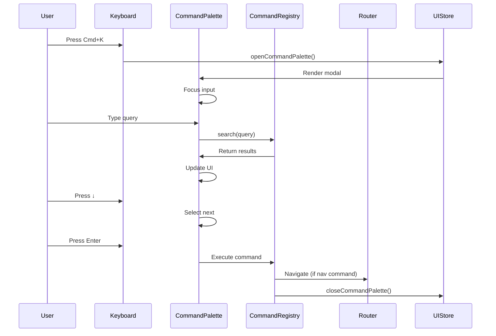
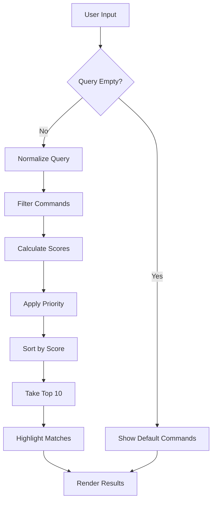
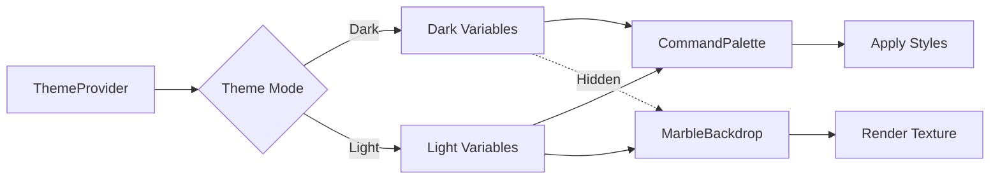

# Command Palette Design Document

## Overview

The Command Palette is a keyboard-first modal interface inspired by Obsidian and Readwise that provides unified access to navigation, commands, filters, and search functionality. The design enhances the existing basic implementation with fuzzy search, improved keyboard navigation, theme-aware styling, and a custom marble backdrop for light mode.

### Key Design Principles

1. **Speed First**: All interactions must feel instantaneous (<100ms response time)
2. **Keyboard-Centric**: Every action accessible via keyboard with intuitive shortcuts
3. **Visual Clarity**: Clean, minimal design that doesn't distract from content
4. **Theme Consistency**: Seamless integration with existing light/dark theme system
5. **Extensibility**: Easy to add new commands and categories without refactoring

## Architecture

### Component Hierarchy

```
App
├── ThemeProvider (existing)
├── MainLayout
│   ├── MarbleBackdrop (new - light mode only)
│   ├── AnimatedOrbs (existing)
│   ├── GridPattern (existing)
│   └── ...
└── CommandPalette (enhanced)
    ├── CommandPaletteOverlay
    ├── CommandPaletteModal
    │   ├── SearchBar (enhanced)
    │   │   ├── SearchIcon
    │   │   ├── SearchInput
    │   │   └── EscapeHint
    │   ├── ResultsList
    │   │   ├── CategoryGroup (multiple)
    │   │   │   ├── CategoryHeader
    │   │   │   └── CommandItem (multiple)
    │   │   │       ├── ItemIcon
    │   │   │       ├── ItemLabel
    │   │   │       └── ShortcutHint (optional)
    │   │   └── EmptyState
    │   └── Footer
    │       └── KeyboardHints
    └── CommandRegistry (new service)
```

### State Management

The design leverages the existing Zustand store pattern:

**UIStore (existing - enhanced)**
- `commandPaletteOpen: boolean` - Modal visibility state
- `theme: 'light' | 'dark'` - Current theme mode
- Actions: `openCommandPalette()`, `closeCommandPalette()`, `toggleTheme()`

**CommandPalette Component State (local)**
- `query: string` - Current search input
- `selectedIndex: number` - Currently highlighted result
- `filteredCommands: Command[]` - Search results
- `isExecuting: boolean` - Command execution state

## Components and Interfaces

### 1. MarbleBackdrop Component (New)

A decorative background component that renders only in light mode with an off-white marble texture featuring gold and black accents.

**Props Interface:**
```typescript
interface MarbleBackdropProps {
  // No props needed - reads theme from context
}
```

**Implementation Details:**
- Positioned as fixed full-screen background layer (z-index: -1)
- Uses CSS background-image with SVG or canvas-based marble texture
- Animated subtle gradient overlay with gold/black colors
- Opacity transitions when theme changes
- Performance: Uses CSS transforms and will-change for GPU acceleration

**Visual Specifications:**
- Base color: `#fafaf8` (off-white)
- Marble veins: Mix of `rgba(0, 0, 0, 0.08)` (black) and `rgba(184, 134, 11, 0.12)` (gold)
- Animated gradient: Radial gradient with gold (`#daa520`) and black (`#000000`) at 5% opacity
- Animation: Slow 20-second loop with subtle position shifts

### 2. Enhanced CommandPalette Component

**Props Interface:**
```typescript
interface Command {
  id: string;
  label: string;
  description?: string; // New - secondary text
  icon: LucideIcon;
  keywords: string[];
  category: 'navigation' | 'action' | 'filter' | 'search' | 'help';
  action: () => void | Promise<void>;
  shortcut?: string;
  priority?: number; // New - for result ranking
}

interface CommandPaletteProps {
  commands?: Command[];
  maxResults?: number; // Default: 10
}
```

**Key Enhancements:**
- Fuzzy search algorithm using Fuse.js or custom implementation
- Result ranking based on relevance score and priority
- Highlight matching characters in results
- Wrap-around navigation (top ↔ bottom)
- Loading state during async command execution
- Smooth animations using Framer Motion

### 3. SearchBar Component (Enhanced)

**Features:**
- Auto-focus on mount
- Clear button when query is not empty
- Real-time search with debouncing (50ms)
- Search icon with theme-aware color
- Escape key hint badge

**Styling:**
- Height: 56px
- Border: 1px solid `var(--border-medium)`
- Border-radius: `var(--radius-lg)`
- Background: `var(--surface-raised)`
- Focus ring: 2px `var(--accent-medium)` with glow effect

### 4. ResultsList Component

**Features:**
- Virtual scrolling for performance (if >50 results)
- Grouped by category with headers
- Smooth scroll to selected item
- Maximum 10 visible results with scroll
- Empty state with helpful message

**Result Item Styling:**
- Height: 48px
- Padding: 12px 16px
- Hover: `var(--surface-accent)` background
- Selected: `var(--accent-subtle)` background with left border accent
- Icon size: 18px
- Gap between elements: 12px

### 5. CommandRegistry Service (New)

A centralized service for managing available commands.

**Interface:**
```typescript
interface CommandRegistry {
  commands: Map<string, Command>;
  
  register(command: Command): void;
  unregister(commandId: string): void;
  getAll(): Command[];
  getByCategory(category: string): Command[];
  search(query: string): Command[];
}
```

**Implementation:**
- Singleton pattern for global access
- Event emitter for command updates
- Validation for command registration
- Built-in commands registered on initialization
- Extensible for plugins/extensions

## Data Models

### Command Model

```typescript
interface Command {
  id: string;                    // Unique identifier
  label: string;                 // Display name
  description?: string;          // Optional secondary text
  icon: LucideIcon;             // Icon component
  keywords: string[];           // Search keywords
  category: CommandCategory;    // Grouping category
  action: CommandAction;        // Execution function
  shortcut?: string;            // Keyboard shortcut hint
  priority?: number;            // Ranking weight (0-100)
  enabled?: () => boolean;      // Conditional availability
}

type CommandCategory = 
  | 'navigation' 
  | 'action' 
  | 'filter' 
  | 'search' 
  | 'help';

type CommandAction = () => void | Promise<void>;
```

### Search Result Model

```typescript
interface SearchResult {
  command: Command;
  score: number;              // Relevance score (0-1)
  matches: MatchRange[];      // Character match positions
}

interface MatchRange {
  start: number;
  end: number;
}
```

### Theme Configuration

```typescript
interface ThemeConfig {
  mode: 'light' | 'dark';
  colors: {
    background: string;
    surface: string;
    border: string;
    text: string;
    accent: string;
  };
  backdrop?: {
    enabled: boolean;
    type: 'marble' | 'gradient' | 'solid';
  };
}
```

## Fuzzy Search Algorithm

### Implementation Strategy

Use a lightweight fuzzy matching algorithm optimized for command palette use case:

**Algorithm Steps:**
1. Convert query and command text to lowercase
2. Calculate character match score:
   - Consecutive matches: +10 points
   - Word boundary matches: +5 points
   - Any match: +1 point
3. Apply priority multiplier from command config
4. Sort by score descending
5. Return top N results (default: 10)

**Performance Targets:**
- Search execution: <10ms for 100 commands
- UI update: <50ms total (search + render)
- Memory: <1MB for command registry

**Match Highlighting:**
- Wrap matched characters in `<mark>` elements
- Style with `var(--accent-bright)` color and medium font weight

## Theme-Aware Styling

### Dark Mode (Default)

**Command Palette:**
- Overlay: `rgba(0, 0, 0, 0.8)` with backdrop blur
- Modal background: `var(--surface-raised)` (#2a2a2a)
- Border: `var(--border-medium)` (rgba(255, 255, 255, 0.12))
- Text: `var(--text-primary)` (#ffffff)
- Accent: Purple system (`--accent-medium` #8b5cf6)
- Shadow: `var(--shadow-lg)` with purple glow

**Search Bar:**
- Background: `var(--surface-base)` (#1a1a1a)
- Border: `var(--border-subtle)`
- Focus: Purple glow with `--accent-glow`

**Results:**
- Hover: `var(--surface-accent)` (rgba(139, 92, 246, 0.12))
- Selected: `var(--accent-subtle)` with 2px left border
- Category headers: `var(--text-tertiary)` (#808080)

### Light Mode

**Command Palette:**
- Overlay: `rgba(255, 255, 255, 0.8)` with backdrop blur
- Modal background: `var(--surface-raised)` (#fafafa)
- Border: `var(--border-medium)` (rgba(0, 0, 0, 0.12))
- Text: `var(--text-primary)` (#000000)
- Accent: Gold system (`--accent-medium` #daa520)
- Shadow: `var(--shadow-lg)` with subtle gold glow

**Search Bar:**
- Background: `var(--background)` (#ffffff)
- Border: `var(--border-subtle)`
- Focus: Gold glow with `--accent-glow`

**Results:**
- Hover: `var(--surface-accent)` (rgba(218, 165, 32, 0.05))
- Selected: `var(--accent-subtle)` with 2px left border
- Category headers: `var(--text-tertiary)` (#808080)

**Marble Backdrop:**
- Visible only in light mode
- Positioned behind all content
- Subtle animated gradient overlay
- Does not interfere with content readability

## Keyboard Interactions

### Global Shortcuts

| Shortcut | Action | Context |
|----------|--------|---------|
| `Cmd/Ctrl + K` | Toggle command palette | Global |
| `Escape` | Close command palette | Palette open |

### Palette Navigation

| Key | Action | Behavior |
|-----|--------|----------|
| `↓` / `Down Arrow` | Next result | Wraps to first |
| `↑` / `Up Arrow` | Previous result | Wraps to last |
| `Enter` | Execute command | Closes palette |
| `Escape` | Close palette | Returns focus |
| `Tab` | Next result | Alternative to ↓ |
| `Shift + Tab` | Previous result | Alternative to ↑ |

### Command Shortcuts (Future)

Commands can define their own shortcuts that work globally:
- `G D` - Go to Dashboard
- `G L` - Go to Library
- `G G` - Go to Knowledge Graph
- `N` - New Resource
- `/` - Focus search

## Animations and Transitions

### Modal Entrance/Exit

```typescript
const modalVariants = {
  hidden: {
    opacity: 0,
    scale: 0.95,
    y: -20,
  },
  visible: {
    opacity: 1,
    scale: 1,
    y: 0,
    transition: {
      type: 'spring',
      damping: 25,
      stiffness: 300,
      duration: 0.2,
    },
  },
  exit: {
    opacity: 0,
    scale: 0.95,
    y: -20,
    transition: {
      duration: 0.15,
    },
  },
};
```

### Result Item Hover

```typescript
const itemVariants = {
  hover: {
    x: 4,
    transition: {
      type: 'spring',
      stiffness: 400,
      damping: 25,
    },
  },
};
```

### Marble Backdrop Animation

```css
@keyframes marbleShift {
  0%, 100% {
    background-position: 0% 0%;
  }
  50% {
    background-position: 100% 100%;
  }
}

.marble-backdrop {
  animation: marbleShift 20s ease-in-out infinite;
}
```

## Error Handling

### Command Execution Errors

1. **Async Command Failure:**
   - Show toast notification with error message
   - Log error to console for debugging
   - Keep palette open for retry
   - Display error icon next to failed command

2. **Invalid Command:**
   - Validate command structure on registration
   - Log warning for invalid commands
   - Skip invalid commands in search results

3. **Navigation Errors:**
   - Catch routing errors
   - Fallback to home page
   - Show error toast

### Search Errors

1. **Empty Query:**
   - Show default/suggested commands
   - Display category groups
   - Show help hint

2. **No Results:**
   - Display friendly empty state
   - Suggest alternative searches
   - Show "Press ESC to close" hint

3. **Search Performance:**
   - Debounce input (50ms)
   - Cancel previous search on new input
   - Show loading indicator if >100ms

## Performance Optimizations

### Rendering

1. **Virtual Scrolling:**
   - Implement for >50 results
   - Render only visible items + buffer
   - Use `react-window` or custom implementation

2. **Memoization:**
   - Memo command items to prevent re-renders
   - Use `useMemo` for filtered results
   - Use `useCallback` for event handlers

3. **Debouncing:**
   - Debounce search input (50ms)
   - Throttle scroll events (16ms)

### Search Algorithm

1. **Indexing:**
   - Pre-process command keywords on registration
   - Build search index for O(1) lookups
   - Cache search results for repeated queries

2. **Early Exit:**
   - Stop searching after finding N results
   - Skip disabled commands
   - Filter by category first if specified

### Marble Backdrop

1. **GPU Acceleration:**
   - Use CSS transforms for animations
   - Apply `will-change: transform` hint
   - Use `transform: translateZ(0)` for layer promotion

2. **Conditional Rendering:**
   - Only render in light mode
   - Lazy load texture assets
   - Use CSS background instead of canvas if possible

## Testing Strategy

### Unit Tests

**CommandRegistry Service:**
- ✓ Register command successfully
- ✓ Unregister command successfully
- ✓ Prevent duplicate command IDs
- ✓ Validate command structure
- ✓ Search returns correct results
- ✓ Filter by category works

**Fuzzy Search Algorithm:**
- ✓ Exact match returns highest score
- ✓ Partial match returns results
- ✓ Case-insensitive matching
- ✓ Keyword matching works
- ✓ Priority affects ranking
- ✓ No results for invalid query

**CommandPalette Component:**
- ✓ Opens with Cmd/Ctrl+K
- ✓ Closes with Escape
- ✓ Filters results on input
- ✓ Navigates with arrow keys
- ✓ Executes command on Enter
- ✓ Wraps navigation at boundaries
- ✓ Auto-focuses input on open
- ✓ Displays empty state correctly

### Integration Tests

**Theme Integration:**
- ✓ Applies dark theme styles correctly
- ✓ Applies light theme styles correctly
- ✓ Marble backdrop visible only in light mode
- ✓ Theme switch updates palette immediately
- ✓ Accent colors match theme system

**Navigation Integration:**
- ✓ Navigation commands route correctly
- ✓ Palette closes after navigation
- ✓ Browser history updates properly
- ✓ Deep links work from palette

**Store Integration:**
- ✓ UIStore state updates correctly
- ✓ Palette state persists across renders
- ✓ Multiple palette instances share state

### Visual Regression Tests

- ✓ Palette appearance in dark mode
- ✓ Palette appearance in light mode
- ✓ Marble backdrop rendering
- ✓ Search results layout
- ✓ Empty state appearance
- ✓ Hover states
- ✓ Selected state
- ✓ Animation smoothness

### Accessibility Tests

- ✓ Keyboard navigation works
- ✓ Screen reader announces results
- ✓ Focus management correct
- ✓ ARIA labels present
- ✓ Color contrast meets WCAG AA
- ✓ Reduced motion respected

## Accessibility Considerations

### ARIA Attributes

```typescript
<div
  role="dialog"
  aria-modal="true"
  aria-labelledby="command-palette-label"
>
  <input
    role="combobox"
    aria-expanded={filteredCommands.length > 0}
    aria-controls="command-palette-results"
    aria-activedescendant={`command-${selectedIndex}`}
  />
  <div
    role="listbox"
    id="command-palette-results"
  >
    <div role="option" id={`command-${index}`}>
      {/* Command item */}
    </div>
  </div>
</div>
```

### Focus Management

1. **On Open:**
   - Trap focus within modal
   - Focus search input
   - Store previous focus for restoration

2. **On Close:**
   - Restore focus to trigger element
   - Remove focus trap
   - Clear selection state

3. **Navigation:**
   - Maintain focus on input during arrow navigation
   - Update `aria-activedescendant` for screen readers
   - Scroll selected item into view

### Screen Reader Support

- Announce result count on search
- Announce selected command on navigation
- Announce command execution
- Provide helpful hints in empty state

### Reduced Motion

```typescript
const prefersReducedMotion = useReducedMotion();

const modalVariants = prefersReducedMotion
  ? { hidden: { opacity: 0 }, visible: { opacity: 1 } }
  : standardVariants;
```

## File Structure

```
frontend/src/
├── components/
│   ├── common/
│   │   ├── CommandPalette.tsx (enhanced)
│   │   ├── CommandPalette.css (enhanced)
│   │   └── CommandPalette.test.tsx (new)
│   └── background/
│       ├── MarbleBackdrop.tsx (new)
│       ├── MarbleBackdrop.css (new)
│       └── MarbleBackdrop.test.tsx (new)
├── services/
│   ├── commandRegistry.ts (new)
│   └── commandRegistry.test.ts (new)
├── utils/
│   ├── fuzzySearch.ts (new)
│   └── fuzzySearch.test.ts (new)
├── hooks/
│   └── useCommandPalette.ts (existing - no changes)
└── styles/
    └── variables.css (existing - minor additions)
```

## Dependencies

### New Dependencies

```json
{
  "fuse.js": "^7.0.0" // Optional - for advanced fuzzy search
}
```

### Existing Dependencies (Used)

- `react` - Component framework
- `framer-motion` - Animations
- `zustand` - State management
- `lucide-react` - Icons
- `react-router-dom` - Navigation

## Migration Strategy

### Phase 1: Core Enhancements (Existing Component)

1. Enhance fuzzy search algorithm
2. Improve keyboard navigation (wrap-around)
3. Add result ranking and highlighting
4. Optimize performance with memoization

### Phase 2: Visual Enhancements

1. Create MarbleBackdrop component
2. Integrate with MainLayout
3. Enhance theme-aware styling
4. Add smooth animations

### Phase 3: Extensibility

1. Create CommandRegistry service
2. Refactor command registration
3. Add command validation
4. Document extension API

### Phase 4: Polish

1. Add comprehensive tests
2. Improve accessibility
3. Optimize performance
4. Add documentation

## Future Enhancements

### Potential Features

1. **Recent Commands:**
   - Track command usage
   - Show frequently used commands first
   - Persist history in localStorage

2. **Command Chaining:**
   - Execute multiple commands in sequence
   - Support command arguments
   - Macro recording

3. **Plugins:**
   - Third-party command registration
   - Custom command categories
   - Extension marketplace

4. **AI-Powered Search:**
   - Natural language queries
   - Semantic search
   - Command suggestions

5. **Customization:**
   - User-defined shortcuts
   - Custom themes
   - Layout preferences

## Design Decisions and Rationales

### Why Fuzzy Search?

Fuzzy search allows users to find commands quickly without typing exact matches. This is essential for power users who want speed over precision. The trade-off is slightly more complex implementation, but the UX benefit is significant.

### Why Marble Backdrop Only in Light Mode?

The marble texture provides visual interest and premium feel in light mode where backgrounds can feel plain. Dark mode already has the animated orbs and grid pattern, so adding marble would be visually overwhelming. This keeps each theme distinct and purposeful.

### Why Centralized Command Registry?

A registry pattern allows commands to be registered from anywhere in the application, making the system extensible. This is crucial for future plugin support and keeps command definitions close to their implementation rather than in a central config file.

### Why Limit to 10 Results?

Limiting results improves performance and forces better search relevance. Users can refine their query if needed. This follows the pattern of successful command palettes like VS Code and Raycast.

### Why Framer Motion Over CSS?

Framer Motion provides declarative animations with better control over complex sequences. It also handles reduced motion preferences automatically and provides better TypeScript support than CSS animations.

## Mermaid Diagrams

### Component Interaction Flow



### Search Algorithm Flow



### Theme System Integration


