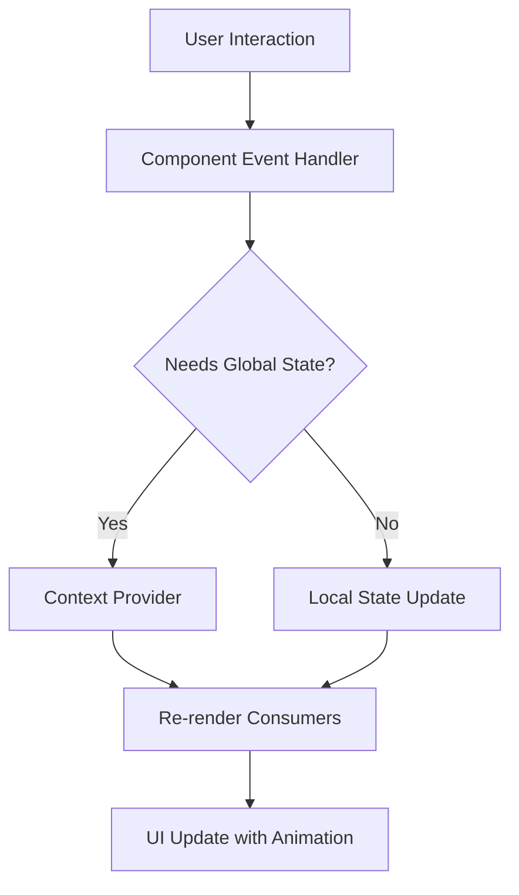

# Design Document: Phase 0 - Foundation Enhancement

## Overview

Phase 0 establishes the foundational infrastructure for the Neo Alexandria frontend. This phase focuses on creating a production-ready base with polished UI patterns, smooth interactions, and robust accessibility features. The design prioritizes performance (FCP < 1.5s), accessibility (WCAG 2.1 AA compliance), and developer experience through reusable components and clear architectural patterns.

The implementation uses React 18+ with TypeScript, Tailwind CSS for styling, and Framer Motion for animations. All components follow atomic design principles with clear separation between UI primitives and feature-specific logic.

## Architecture

### Component Hierarchy

```
src/
├── components/
│   ├── ui/                    # Atomic UI primitives
│   │   ├── Button/
│   │   ├── Card/
│   │   ├── Input/
│   │   ├── Skeleton/
│   │   └── Toast/
│   ├── features/              # Domain-specific components
│   │   ├── ResourceCard/
│   │   ├── LibraryPanel/
│   │   ├── CommandPalette/
│   │   └── ViewToggle/
│   └── layout/                # Layout components
│       ├── MainLayout/
│       └── Modal/
├── lib/
│   ├── api/                   # API interfaces and mocks
│   │   ├── types.ts
│   │   ├── mock-data.ts
│   │   └── client.ts
│   ├── hooks/                 # Custom React hooks
│   │   ├── useKeyboardShortcut.ts
│   │   ├── useFocusTrap.ts
│   │   └── useLocalStorage.ts
│   └── utils/                 # Utility functions
│       ├── animations.ts
│       └── focus-management.ts
├── contexts/
│   ├── ToastContext.tsx
│   └── ThemeContext.tsx
└── styles/
    ├── globals.css
    └── animations.css
```

### State Management Strategy

For Phase 0, we use React Context for global state (theme, toasts) and local component state for UI interactions. This keeps the architecture simple while remaining scalable for future phases.

**Global State (Context):**
- Theme preference (light/dark)
- Toast notification queue
- Command palette open/closed state

**Local State (useState/useReducer):**
- View mode (grid/table)
- Loading states
- Form inputs
- Animation states

### Data Flow



## Components and Interfaces

### 1. Skeleton Loading System

**Purpose:** Provide visual feedback during data loading to prevent layout shift and improve perceived performance.

**Component Structure:**
```typescript
// src/components/ui/Skeleton/Skeleton.tsx
interface SkeletonProps {
  variant: 'text' | 'circular' | 'rectangular';
  width?: string | number;
  height?: string | number;
  animation?: 'pulse' | 'wave' | 'none';
  className?: string;
}

// Preset skeleton components
<SkeletonCard />      // Matches ResourceCard dimensions
<SkeletonTable />     // Matches table row structure
<SkeletonText />      // For text content
```

**Design Decisions:**
- Use CSS animations (not JS) for 60fps performance
- Pulse animation: 1.5s duration, ease-in-out timing
- Base color: `bg-gray-200 dark:bg-gray-700`
- Dimensions match final content to prevent layout shift

**Implementation Pattern:**
```typescript
const LibraryPanel = () => {
  const { data, isLoading } = useResources();
  
  if (isLoading) {
    return (
      <div className="grid grid-cols-3 gap-4">
        {Array.from({ length: 6 }).map((_, i) => (
          <SkeletonCard key={i} />
        ))}
      </div>
    );
  }
  
  return <ResourceGrid resources={data} />;
};
```

### 2. View Toggle System

**Purpose:** Allow users to switch between grid (card) and table views of library resources.

**Component Structure:**
```typescript
// src/components/features/ViewToggle/ViewToggle.tsx
interface ViewToggleProps {
  value: 'grid' | 'table';
  onChange: (view: 'grid' | 'table') => void;
  className?: string;
}

// Usage with persistence
const LibraryPanel = () => {
  const [viewMode, setViewMode] = useLocalStorage<'grid' | 'table'>(
    'library-view-mode',
    'grid'
  );
  
  return (
    <>
      <ViewToggle value={viewMode} onChange={setViewMode} />
      <AnimatePresence mode="wait">
        {viewMode === 'grid' ? (
          <ResourceGrid key="grid" />
        ) : (
          <ResourceTable key="table" />
        )}
      </AnimatePresence>
    </>
  );
};
```

**Animation Strategy:**
- Exit animation: fade-out + scale-down (150ms)
- Enter animation: fade-in + slide-up (300ms)
- Use `AnimatePresence` from Framer Motion for smooth transitions
- Maintain scroll position using `useScrollRestoration` hook

### 3. Command Palette

**Purpose:** Provide keyboard-driven quick access to features, search, and navigation.

**Component Structure:**
```typescript
// src/components/features/CommandPalette/CommandPalette.tsx
interface Command {
  id: string;
  label: string;
  category: 'Resources' | 'Collections' | 'Actions';
  icon?: React.ReactNode;
  keywords?: string[];
  onSelect: () => void;
}

interface CommandPaletteProps {
  isOpen: boolean;
  onClose: () => void;
  commands: Command[];
}
```

**Key Features:**
- Fuzzy search using `fuse.js` (threshold: 0.3)
- Keyboard navigation (↑↓ arrows, Enter to select, Esc to close)
- Focus trap implementation
- Results grouped by category
- Recent commands tracking (localStorage)
- Maximum 50ms search latency

**Keyboard Shortcut Hook:**
```typescript
// src/lib/hooks/useKeyboardShortcut.ts
const useKeyboardShortcut = (
  key: string,
  callback: () => void,
  modifiers?: { ctrl?: boolean; meta?: boolean; shift?: boolean }
) => {
  useEffect(() => {
    const handler = (e: KeyboardEvent) => {
      if (e.key === key && 
          (!modifiers?.ctrl || e.ctrlKey) &&
          (!modifiers?.meta || e.metaKey)) {
        e.preventDefault();
        callback();
      }
    };
    window.addEventListener('keydown', handler);
    return () => window.removeEventListener('keydown', handler);
  }, [key, callback, modifiers]);
};

// Usage
useKeyboardShortcut('k', openCommandPalette, { meta: true, ctrl: true });
```

### 4. Toast Notification System

**Purpose:** Provide non-blocking feedback for user actions and system events.

**Architecture:**
```typescript
// src/contexts/ToastContext.tsx
interface Toast {
  id: string;
  variant: 'success' | 'error' | 'info' | 'loading';
  message: string;
  duration?: number; // null for manual dismiss
}

interface ToastContextValue {
  toasts: Toast[];
  showToast: (toast: Omit<Toast, 'id'>) => string;
  dismissToast: (id: string) => void;
  updateToast: (id: string, updates: Partial<Toast>) => void;
}
```

**Queue Management:**
- Maximum 3 visible toasts at once
- FIFO queue for overflow
- Auto-dismiss: success/info (4s), loading (manual), error (manual)
- Position: top-right corner
- Stacking: vertical with 8px gap

**Animation Pattern:**
```typescript
// Entry: slide-in from right + fade-in (200ms)
// Exit: slide-out to right + fade-out (200ms)
// Stacking: animate Y position when toasts are added/removed
```

### 5. Theme System

**Purpose:** Provide smooth light/dark mode switching without FOUC.

**Implementation Strategy:**
```typescript
// src/contexts/ThemeContext.tsx
interface ThemeContextValue {
  theme: 'light' | 'dark';
  setTheme: (theme: 'light' | 'dark') => void;
  toggleTheme: () => void;
}

// Prevent FOUC with inline script in HTML head
<script>
  (function() {
    const theme = localStorage.getItem('theme') || 'light';
    document.documentElement.classList.add(theme);
  })();
</script>
```

**CSS Architecture:**
```css
/* src/styles/globals.css */
:root {
  --color-bg-primary: #ffffff;
  --color-bg-secondary: #f3f4f6;
  --color-text-primary: #111827;
  --color-text-secondary: #6b7280;
  /* ... more variables */
  
  --transition-base: 200ms ease-out;
}

.dark {
  --color-bg-primary: #111827;
  --color-bg-secondary: #1f2937;
  --color-text-primary: #f9fafb;
  --color-text-secondary: #d1d5db;
}

* {
  transition: background-color var(--transition-base),
              color var(--transition-base),
              border-color var(--transition-base);
}
```

### 6. Focus Management System

**Purpose:** Ensure keyboard navigation works correctly and meets WCAG 2.1 AA standards.

**Focus Trap Implementation:**
```typescript
// src/lib/hooks/useFocusTrap.ts
const useFocusTrap = (ref: RefObject<HTMLElement>, isActive: boolean) => {
  useEffect(() => {
    if (!isActive || !ref.current) return;
    
    const focusableElements = ref.current.querySelectorAll(
      'button, [href], input, select, textarea, [tabindex]:not([tabindex="-1"])'
    );
    
    const firstElement = focusableElements[0] as HTMLElement;
    const lastElement = focusableElements[focusableElements.length - 1] as HTMLElement;
    
    const handleTab = (e: KeyboardEvent) => {
      if (e.key !== 'Tab') return;
      
      if (e.shiftKey && document.activeElement === firstElement) {
        e.preventDefault();
        lastElement.focus();
      } else if (!e.shiftKey && document.activeElement === lastElement) {
        e.preventDefault();
        firstElement.focus();
      }
    };
    
    firstElement?.focus();
    document.addEventListener('keydown', handleTab);
    return () => document.removeEventListener('keydown', handleTab);
  }, [ref, isActive]);
};
```

**Focus Indicator Styling:**
```css
/* Visible focus indicators for all interactive elements */
*:focus-visible {
  outline: 2px solid var(--color-primary);
  outline-offset: 2px;
  border-radius: 4px;
}

/* Skip to content link */
.skip-to-content {
  position: absolute;
  top: -40px;
  left: 0;
  background: var(--color-bg-primary);
  padding: 8px;
  z-index: 100;
}

.skip-to-content:focus {
  top: 0;
}
```

### 7. Micro-interactions Library

**Purpose:** Provide consistent, reusable animation patterns across the application.

**Animation Utilities:**
```typescript
// src/lib/utils/animations.ts
export const animations = {
  fadeIn: {
    initial: { opacity: 0 },
    animate: { opacity: 1 },
    exit: { opacity: 0 },
    transition: { duration: 0.2, ease: 'easeOut' }
  },
  
  slideUp: {
    initial: { opacity: 0, y: 20 },
    animate: { opacity: 1, y: 0 },
    exit: { opacity: 0, y: -20 },
    transition: { duration: 0.3, ease: 'easeOut' }
  },
  
  scalePress: {
    whileTap: { scale: 0.95 },
    transition: { duration: 0.1, ease: 'easeOut' }
  },
  
  hover: {
    whileHover: { scale: 1.02 },
    transition: { duration: 0.15, ease: 'easeOut' }
  }
};

// Usage
<motion.button {...animations.scalePress}>
  Click me
</motion.button>
```

**Standard Durations:**
- Instant: 100ms (button press, hover)
- Fast: 200ms (fade, theme transition)
- Normal: 300ms (slide, layout changes)
- Slow: 500ms (complex transitions)

## Data Models

### API Type Definitions

```typescript
// src/lib/api/types.ts

// Matches backend Pydantic models
export interface Resource {
  id: string;
  title: string;
  url: string;
  resource_type: 'article' | 'video' | 'book' | 'paper';
  description?: string;
  tags: string[];
  created_at: string;
  updated_at: string;
  metadata?: Record<string, unknown>;
}

export interface Collection {
  id: string;
  name: string;
  description?: string;
  resource_count: number;
  created_at: string;
  updated_at: string;
}

export interface SearchResult {
  resources: Resource[];
  total: number;
  page: number;
  page_size: number;
}

// API client interface
export interface ApiClient {
  resources: {
    list: (params?: ListParams) => Promise<SearchResult>;
    get: (id: string) => Promise<Resource>;
    create: (data: CreateResourceDto) => Promise<Resource>;
    update: (id: string, data: UpdateResourceDto) => Promise<Resource>;
    delete: (id: string) => Promise<void>;
  };
  collections: {
    list: () => Promise<Collection[]>;
    get: (id: string) => Promise<Collection>;
  };
  search: (query: string) => Promise<SearchResult>;
}
```

### Mock Data Strategy

```typescript
// src/lib/api/mock-data.ts
export const mockResources: Resource[] = [
  {
    id: '1',
    title: 'Introduction to React Hooks',
    url: 'https://example.com/react-hooks',
    resource_type: 'article',
    description: 'A comprehensive guide to React Hooks',
    tags: ['react', 'javascript', 'frontend'],
    created_at: '2024-01-15T10:00:00Z',
    updated_at: '2024-01-15T10:00:00Z'
  },
  // ... more mock data
];

// Mock API client with simulated latency
export const createMockApiClient = (): ApiClient => ({
  resources: {
    list: async (params) => {
      await delay(300); // Simulate network latency
      return {
        resources: mockResources,
        total: mockResources.length,
        page: params?.page || 1,
        page_size: params?.page_size || 20
      };
    },
    // ... other methods
  },
  // ... other endpoints
});
```

## Error Handling

### Error Boundary Strategy

```typescript
// src/components/ErrorBoundary.tsx
class ErrorBoundary extends React.Component<Props, State> {
  static getDerivedStateFromError(error: Error) {
    return { hasError: true, error };
  }
  
  componentDidCatch(error: Error, errorInfo: ErrorInfo) {
    // Log to error reporting service
    console.error('Error caught by boundary:', error, errorInfo);
  }
  
  render() {
    if (this.state.hasError) {
      return <ErrorFallback error={this.state.error} />;
    }
    return this.props.children;
  }
}
```

### API Error Handling

```typescript
// src/lib/api/client.ts
const handleApiError = (error: unknown): never => {
  if (error instanceof Response) {
    throw new ApiError(
      error.status,
      error.statusText,
      await error.json()
    );
  }
  throw new NetworkError('Failed to connect to server');
};

// Usage in components
const ResourceList = () => {
  const { data, error, isLoading } = useResources();
  
  if (error) {
    showToast({
      variant: 'error',
      message: error.message || 'Failed to load resources'
    });
    return <ErrorState error={error} />;
  }
  
  // ... render logic
};
```

## Testing Strategy

### Unit Testing

**Tools:** Vitest + React Testing Library

**Coverage Targets:**
- Utility functions: 100%
- Hooks: 90%
- UI components: 80%
- Feature components: 70%

**Test Patterns:**
```typescript
// src/components/ui/Button/Button.test.tsx
describe('Button', () => {
  it('renders with correct text', () => {
    render(<Button>Click me</Button>);
    expect(screen.getByText('Click me')).toBeInTheDocument();
  });
  
  it('calls onClick when clicked', () => {
    const handleClick = vi.fn();
    render(<Button onClick={handleClick}>Click</Button>);
    fireEvent.click(screen.getByText('Click'));
    expect(handleClick).toHaveBeenCalledTimes(1);
  });
  
  it('applies scale animation on press', () => {
    const { container } = render(<Button>Click</Button>);
    const button = container.firstChild;
    expect(button).toHaveStyle({ transition: expect.stringContaining('100ms') });
  });
});
```

### Integration Testing

**Focus Areas:**
- Command palette keyboard navigation
- Toast queue management
- Theme persistence and application
- Focus trap behavior in modals

```typescript
// src/components/features/CommandPalette/CommandPalette.test.tsx
describe('CommandPalette Integration', () => {
  it('opens on Cmd+K and closes on Escape', async () => {
    render(<App />);
    
    // Open palette
    fireEvent.keyDown(window, { key: 'k', metaKey: true });
    expect(screen.getByRole('dialog')).toBeInTheDocument();
    
    // Close palette
    fireEvent.keyDown(window, { key: 'Escape' });
    await waitFor(() => {
      expect(screen.queryByRole('dialog')).not.toBeInTheDocument();
    });
  });
  
  it('filters commands with fuzzy search', async () => {
    render(<CommandPalette isOpen commands={mockCommands} />);
    const input = screen.getByRole('searchbox');
    
    fireEvent.change(input, { target: { value: 'crt res' } });
    
    await waitFor(() => {
      expect(screen.getByText('Create Resource')).toBeInTheDocument();
      expect(screen.queryByText('Delete Resource')).not.toBeInTheDocument();
    });
  });
});
```

### Accessibility Testing

**Tools:** axe-core + manual keyboard testing

**Test Checklist:**
- [ ] All interactive elements have visible focus indicators
- [ ] Keyboard navigation works without mouse
- [ ] Screen reader announcements are appropriate
- [ ] Color contrast meets WCAG AA (4.5:1 for text)
- [ ] Focus trap works in modals
- [ ] Skip-to-content link is functional

### Performance Testing

**Metrics:**
- First Contentful Paint (FCP): < 1.5s
- Time to Interactive (TTI): < 3.5s
- Skeleton load time: < 100ms
- Command palette open time: < 100ms
- Theme transition: 200ms
- View toggle transition: 300ms

**Testing Approach:**
```typescript
// Use Lighthouse CI in GitHub Actions
// lighthouse.config.js
module.exports = {
  ci: {
    collect: {
      numberOfRuns: 3,
      url: ['http://localhost:3000']
    },
    assert: {
      assertions: {
        'first-contentful-paint': ['error', { maxNumericValue: 1500 }],
        'interactive': ['error', { maxNumericValue: 3500 }],
        'categories:accessibility': ['error', { minScore: 0.95 }]
      }
    }
  }
};
```

## Performance Considerations

### Code Splitting

```typescript
// Lazy load heavy components
const CommandPalette = lazy(() => import('./components/features/CommandPalette'));

// Use Suspense with skeleton fallback
<Suspense fallback={<SkeletonCommandPalette />}>
  <CommandPalette />
</Suspense>
```

### Animation Performance

- Use `transform` and `opacity` for animations (GPU-accelerated)
- Avoid animating `width`, `height`, `top`, `left` (causes reflow)
- Use `will-change` sparingly for complex animations
- Prefer CSS animations over JS for simple transitions

### Bundle Size Optimization

- Tree-shake unused Tailwind classes (configured in `tailwind.config.js`)
- Use dynamic imports for route-based code splitting
- Optimize images with Next.js Image component
- Minimize third-party dependencies

## Migration Path

Phase 0 is the foundation, so there's no migration from a previous system. However, we establish patterns for future phases:

1. **Component Library:** All Phase 0 components become the base for future features
2. **API Interfaces:** Mock implementations will be replaced with real API calls in Phase 1
3. **State Management:** Context-based state can be migrated to Zustand/Redux if needed in later phases
4. **Testing Infrastructure:** Test patterns established here apply to all future phases

## Open Questions

1. **Icon Library:** Should we use Lucide React, Heroicons, or custom SVGs?
   - **Decision:** Lucide React (better TypeScript support, tree-shakeable)

2. **Animation Library:** Framer Motion vs CSS-only animations?
   - **Decision:** Framer Motion for complex interactions, CSS for simple transitions

3. **Command Palette Search:** Build custom fuzzy search or use library?
   - **Decision:** Use `fuse.js` (battle-tested, good performance)

4. **Toast Positioning:** Top-right, bottom-right, or top-center?
   - **Decision:** Top-right (common pattern, doesn't block main content)

## Success Criteria

Phase 0 is complete when:

- [ ] All 10 requirements have passing acceptance criteria
- [ ] Lighthouse accessibility score ≥ 95
- [ ] FCP < 1.5s on 3G connection
- [ ] Zero layout shift (CLS = 0)
- [ ] All components have TypeScript interfaces
- [ ] Test coverage ≥ 80% for critical paths
- [ ] Documentation complete for all public APIs
- [ ] Design system documented in Storybook
