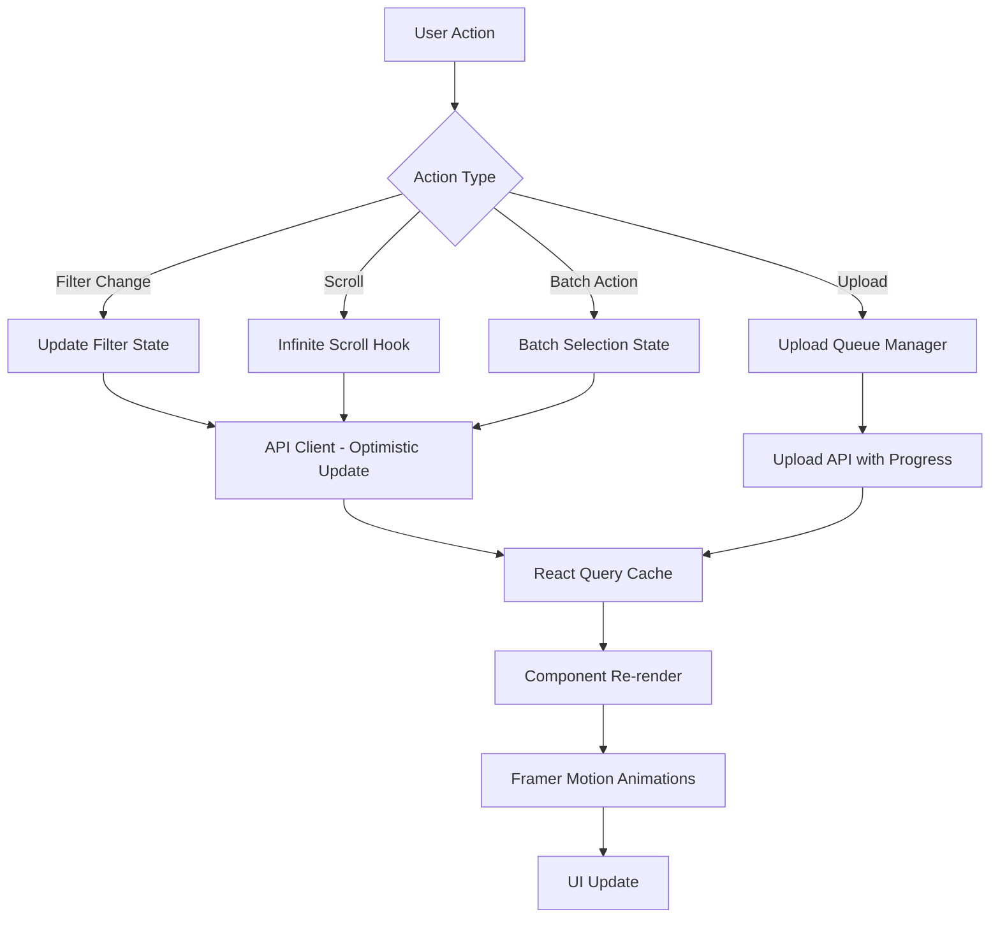

# Design Document: Phase 1 - Core Resource Management

## Overview

Phase 1 builds upon the Phase 0 foundation to deliver comprehensive resource lifecycle management in Neo Alexandria. This phase transforms the basic library view into a powerful resource management system with infinite scroll, faceted filtering, batch operations, file upload with progress tracking, and rich resource detail pages. The design maintains the high-quality UX standards from Phase 0 while integrating with real backend APIs for resource operations.

The implementation extends the existing React 18+ TypeScript stack with new features for data fetching (React Query), file upload (with progress tracking), PDF viewing, and data visualization. All new components follow the established atomic design patterns and reuse Phase 0 primitives (Button, Card, Input, Skeleton, Toast, animations).

**Key Design Principles:**
- Progressive enhancement: Build on Phase 0 without breaking existing functionality
- Performance first: Optimize for large datasets with virtual scrolling and pagination
- Accessibility: Maintain WCAG 2.1 AA compliance across all new features
- Type safety: Strongly typed API contracts matching backend schemas
- Responsive: Mobile-first design that adapts to all screen sizes

## Architecture

### High-Level Component Structure

```
src/
├── components/
│   ├── features/
│   │   ├── library/
│   │   │   ├── LibraryView.tsx           # Enhanced main library view
│   │   │   ├── FilterSidebar.tsx         # Faceted filter sidebar
│   │   │   ├── BatchToolbar.tsx          # Batch action toolbar
│   │   │   └── EmptyState.tsx            # Empty state with illustration
│   │   ├── upload/
│   │   │   ├── UploadZone.tsx            # Drag-and-drop upload area
│   │   │   ├── UploadQueue.tsx           # Multi-file upload queue
│   │   │   ├── UploadItem.tsx            # Individual upload progress
│   │   │   └── URLIngestion.tsx          # URL input form
│   │   └── resource-detail/
│   │       ├── ResourceDetailPage.tsx    # Main detail page
│   │       ├── ResourceHeader.tsx        # Title, metadata, breadcrumbs
│   │       ├── ResourceTabs.tsx          # Tab navigation
│   │       ├── ContentTab.tsx            # PDF viewer tab
│   │       ├── QualityTab.tsx            # Quality visualization tab
│   │       ├── MetadataTab.tsx           # Metadata display tab
│   │       ├── AnnotationsTab.tsx        # Annotations tab (placeholder)
│   │       └── GraphTab.tsx              # Graph visualization tab (placeholder)
│   └── ui/
│       ├── PDFViewer/                    # PDF viewing component
│       ├── QualityChart/                 # Radial quality chart
│       ├── Checkbox/                     # Checkbox for batch selection
│       └── Tabs/                         # Tab component
├── lib/
│   ├── api/
│   │   ├── resources.ts                  # Resource API client
│   │   ├── quality.ts                    # Quality API client
│   │   ├── graph.ts                      # Graph API client
│   │   └── upload.ts                     # Upload API client
│   └── hooks/
│       ├── useInfiniteScroll.ts          # Infinite scroll hook
│       ├── useResourceFilters.ts         # Filter state management
│       ├── useBatchSelection.ts          # Batch selection state
│       ├── useUploadQueue.ts             # Upload queue management
│       └── useResourceDetail.ts          # Resource detail data fetching
└── pages/
    ├── LibraryPage.tsx                   # Main library route
    ├── UploadPage.tsx                    # Upload route
    └── ResourceDetailPage.tsx            # Resource detail route
```

### Data Flow Architecture




### State Management Strategy

**React Query for Server State:**
- Resource lists with pagination and filtering
- Resource detail data
- Quality metrics
- Upload status polling

**Local State for UI:**
- Filter selections (with URL sync)
- Batch selection set
- View density preference (localStorage)
- Upload queue state
- Tab selection (with URL sync)

**Optimistic Updates:**
- Filter changes update UI immediately
- Batch operations show optimistic state
- Rollback on API failure with toast notification

### API Integration Layer

All API clients are strongly typed and match backend Pydantic schemas:

```typescript
// src/lib/api/resources.ts
export interface ResourcesApiClient {
  list(params: ResourceListParams): Promise<ResourceListResponse>;
  get(id: string): Promise<ResourceRead>;
  create(data: ResourceIngestRequest): Promise<ResourceAccepted>;
  update(id: string, data: ResourceUpdate): Promise<ResourceRead>;
  delete(id: string): Promise<void>;
  getStatus(id: string): Promise<ResourceStatus>;
  batchUpdate(ids: string[], data: ResourceUpdate): Promise<void>;
}

// React Query integration
export const useResources = (params: ResourceListParams) => {
  return useInfiniteQuery({
    queryKey: ['resources', params],
    queryFn: ({ pageParam = 0 }) => 
      resourcesApi.list({ ...params, offset: pageParam }),
    getNextPageParam: (lastPage, pages) => 
      lastPage.items.length === params.limit 
        ? pages.length * params.limit 
        : undefined,
  });
};
```

## Components and Interfaces

### 1. Enhanced Library View with Infinite Scroll

**Purpose:** Display resources with smooth infinite scrolling, maintaining performance with large datasets.

**Component Structure:**
```typescript
// src/components/features/library/LibraryView.tsx
interface LibraryViewProps {
  initialFilters?: ResourceFilters;
}

const LibraryView: React.FC<LibraryViewProps> = ({ initialFilters }) => {
  const [filters, setFilters] = useResourceFilters(initialFilters);
  const [density, setDensity] = useLocalStorage('view-density', 'comfortable');
  const [batchMode, setBatchMode] = useState(false);
  const { selectedIds, toggleSelection, clearSelection } = useBatchSelection();
  
  const {
    data,
    fetchNextPage,
    hasNextPage,
    isFetchingNextPage,
    isLoading,
  } = useInfiniteResources(filters);
  
  const sentinelRef = useInfiniteScroll({
    onIntersect: fetchNextPage,
    enabled: hasNextPage && !isFetchingNextPage,
    threshold: 0.8,
  });
  
  // Flatten pages into single array
  const resources = data?.pages.flatMap(page => page.items) ?? [];
  
  return (
    <div className="flex h-full">
      <FilterSidebar filters={filters} onChange={setFilters} />
      <div className="flex-1 overflow-auto">
        <LibraryHeader
          density={density}
          onDensityChange={setDensity}
          batchMode={batchMode}
          onBatchModeToggle={setBatchMode}
        />
        {resources.length === 0 && !isLoading ? (
          <EmptyState filters={filters} onClearFilters={() => setFilters({})} />
        ) : (
          <ResourceGrid
            resources={resources}
            density={density}
            batchMode={batchMode}
            selectedIds={selectedIds}
            onToggleSelection={toggleSelection}
          />
        )}
        <div ref={sentinelRef} className="h-20" />
        {isFetchingNextPage && <SkeletonGrid count={6} />}
      </div>
      {selectedIds.size > 0 && (
        <BatchToolbar
          selectedCount={selectedIds.size}
          onClear={clearSelection}
        />
      )}
    </div>
  );
};
```

**Infinite Scroll Hook:**
```typescript
// src/lib/hooks/useInfiniteScroll.ts
interface UseInfiniteScrollOptions {
  onIntersect: () => void;
  enabled?: boolean;
  threshold?: number;
  rootMargin?: string;
}

export const useInfiniteScroll = ({
  onIntersect,
  enabled = true,
  threshold = 0.8,
  rootMargin = '0px',
}: UseInfiniteScrollOptions) => {
  const sentinelRef = useRef<HTMLDivElement>(null);
  
  useEffect(() => {
    if (!enabled || !sentinelRef.current) return;
    
    const observer = new IntersectionObserver(
      (entries) => {
        if (entries[0].isIntersecting) {
          onIntersect();
        }
      },
      { threshold, rootMargin }
    );
    
    observer.observe(sentinelRef.current);
    return () => observer.disconnect();
  }, [enabled, onIntersect, threshold, rootMargin]);
  
  return sentinelRef;
};
```

**Performance Optimizations:**
- Sentinel element triggers at 80% scroll height
- Debounce scroll events (100ms)
- Cancel in-flight requests on filter change
- Maintain scroll position on page load
- Use React.memo for ResourceCard components


### 2. Faceted Filter Sidebar

**Purpose:** Provide real-time filtering with result counts and optimistic UI updates.

**Component Structure:**
```typescript
// src/components/features/library/FilterSidebar.tsx
interface FilterSidebarProps {
  filters: ResourceFilters;
  onChange: (filters: ResourceFilters) => void;
}

interface FilterFacet {
  label: string;
  value: string;
  count: number;
}

const FilterSidebar: React.FC<FilterSidebarProps> = ({ filters, onChange }) => {
  // Fetch facet counts from backend
  const { data: facets } = useQuery({
    queryKey: ['resource-facets', filters],
    queryFn: () => resourcesApi.getFacets(filters),
  });
  
  const handleFilterChange = (key: string, value: any) => {
    // Optimistic update
    onChange({ ...filters, [key]: value });
  };
  
  return (
    <aside className="w-64 border-r border-gray-200 dark:border-gray-700 p-4 overflow-auto">
      <div className="space-y-6">
        {/* Classification Filter */}
        <FilterSection title="Classification">
          {facets?.classifications.map((facet) => (
            <FilterOption
              key={facet.value}
              label={facet.label}
              count={facet.count}
              checked={filters.classification_code === facet.value}
              onChange={() => handleFilterChange('classification_code', facet.value)}
            />
          ))}
        </FilterSection>
        
        {/* Quality Range Filter */}
        <FilterSection title="Quality Score">
          <RangeSlider
            min={0}
            max={1}
            step={0.1}
            value={filters.min_quality ?? 0}
            onChange={(value) => handleFilterChange('min_quality', value)}
          />
        </FilterSection>
        
        {/* Resource Type Filter */}
        <FilterSection title="Type">
          {facets?.types.map((facet) => (
            <FilterOption
              key={facet.value}
              label={facet.label}
              count={facet.count}
              checked={filters.type === facet.value}
              onChange={() => handleFilterChange('type', facet.value)}
            />
          ))}
        </FilterSection>
        
        {/* Language Filter */}
        <FilterSection title="Language">
          {facets?.languages.map((facet) => (
            <FilterOption
              key={facet.value}
              label={facet.label}
              count={facet.count}
              checked={filters.language === facet.value}
              onChange={() => handleFilterChange('language', facet.value)}
            />
          ))}
        </FilterSection>
        
        {/* Read Status Filter */}
        <FilterSection title="Read Status">
          {['unread', 'in_progress', 'completed', 'archived'].map((status) => (
            <FilterOption
              key={status}
              label={status.replace('_', ' ')}
              checked={filters.read_status === status}
              onChange={() => handleFilterChange('read_status', status)}
            />
          ))}
        </FilterSection>
      </div>
      
      <Button
        variant="ghost"
        className="w-full mt-4"
        onClick={() => onChange({})}
      >
        Clear All Filters
      </Button>
    </aside>
  );
};
```

**Filter State Management:**
```typescript
// src/lib/hooks/useResourceFilters.ts
export const useResourceFilters = (initialFilters?: ResourceFilters) => {
  const [searchParams, setSearchParams] = useSearchParams();
  
  // Parse filters from URL
  const filters = useMemo(() => ({
    q: searchParams.get('q') || undefined,
    classification_code: searchParams.get('classification') || undefined,
    type: searchParams.get('type') || undefined,
    language: searchParams.get('language') || undefined,
    read_status: searchParams.get('status') || undefined,
    min_quality: searchParams.get('min_quality') 
      ? parseFloat(searchParams.get('min_quality')!) 
      : undefined,
    ...initialFilters,
  }), [searchParams, initialFilters]);
  
  // Update URL when filters change
  const setFilters = useCallback((newFilters: ResourceFilters) => {
    const params = new URLSearchParams();
    Object.entries(newFilters).forEach(([key, value]) => {
      if (value !== undefined && value !== null) {
        params.set(key, String(value));
      }
    });
    setSearchParams(params);
  }, [setSearchParams]);
  
  return [filters, setFilters] as const;
};
```

**Responsive Behavior:**
- Desktop (≥768px): Fixed sidebar on left
- Mobile (<768px): Collapsible drawer with overlay
- Filter button in header opens drawer on mobile


### 3. Batch Selection and Operations

**Purpose:** Enable multi-select and bulk actions on resources.

**Component Structure:**
```typescript
// src/lib/hooks/useBatchSelection.ts
export const useBatchSelection = () => {
  const [selectedIds, setSelectedIds] = useState<Set<string>>(new Set());
  
  const toggleSelection = useCallback((id: string) => {
    setSelectedIds(prev => {
      const next = new Set(prev);
      if (next.has(id)) {
        next.delete(id);
      } else {
        next.add(id);
      }
      return next;
    });
  }, []);
  
  const selectAll = useCallback((ids: string[]) => {
    setSelectedIds(new Set(ids));
  }, []);
  
  const clearSelection = useCallback(() => {
    setSelectedIds(new Set());
  }, []);
  
  return { selectedIds, toggleSelection, selectAll, clearSelection };
};

// src/components/features/library/BatchToolbar.tsx
interface BatchToolbarProps {
  selectedCount: number;
  onClear: () => void;
}

const BatchToolbar: React.FC<BatchToolbarProps> = ({ selectedCount, onClear }) => {
  const { mutate: batchUpdate } = useMutation({
    mutationFn: (data: { ids: string[]; updates: ResourceUpdate }) =>
      resourcesApi.batchUpdate(data.ids, data.updates),
    onSuccess: () => {
      showToast({ variant: 'success', message: `Updated ${selectedCount} resources` });
      onClear();
    },
  });
  
  return (
    <motion.div
      initial={{ y: 100, opacity: 0 }}
      animate={{ y: 0, opacity: 1 }}
      exit={{ y: 100, opacity: 0 }}
      className="fixed bottom-4 left-1/2 -translate-x-1/2 bg-white dark:bg-gray-800 
                 shadow-lg rounded-lg p-4 flex items-center gap-4 z-50"
    >
      <span className="text-sm font-medium">
        {selectedCount} selected
      </span>
      <div className="flex gap-2">
        <Button size="sm" onClick={() => {/* Add to collection */}}>
          Add to Collection
        </Button>
        <Button size="sm" variant="secondary" onClick={() => {/* Change status */}}>
          Change Status
        </Button>
        <Button size="sm" variant="secondary" onClick={() => {/* Update tags */}}>
          Update Tags
        </Button>
        <Button size="sm" variant="ghost" onClick={onClear}>
          Clear
        </Button>
      </div>
    </motion.div>
  );
};
```

**Keyboard Shortcuts:**
- `Cmd/Ctrl + A`: Select all visible resources
- `Shift + Click`: Range selection
- `Escape`: Clear selection

### 4. View Density Toggle

**Purpose:** Allow users to customize resource card spacing.

**Implementation:**
```typescript
// src/components/features/library/LibraryHeader.tsx
type Density = 'compact' | 'comfortable' | 'spacious';

const densityConfig: Record<Density, { gap: string; cardSize: string }> = {
  compact: { gap: 'gap-2', cardSize: 'p-3' },
  comfortable: { gap: 'gap-4', cardSize: 'p-4' },
  spacious: { gap: 'gap-6', cardSize: 'p-6' },
};

const DensityToggle: React.FC<{ value: Density; onChange: (d: Density) => void }> = 
  ({ value, onChange }) => (
    <div className="flex gap-1 bg-gray-100 dark:bg-gray-800 rounded-lg p-1">
      {(['compact', 'comfortable', 'spacious'] as Density[]).map((density) => (
        <button
          key={density}
          onClick={() => onChange(density)}
          className={cn(
            'px-3 py-1 rounded text-sm transition-colors',
            value === density
              ? 'bg-white dark:bg-gray-700 shadow-sm'
              : 'hover:bg-gray-200 dark:hover:bg-gray-700'
          )}
        >
          {density}
        </button>
      ))}
    </div>
  );
```

**Animation:**
- Smooth layout transition using Framer Motion's `layout` prop
- 300ms duration with ease-out timing
- Maintain scroll position during transition


### 5. Upload System

**Purpose:** Handle file and URL uploads with progress tracking and error recovery.

**Component Architecture:**
```typescript
// src/components/features/upload/UploadZone.tsx
interface UploadZoneProps {
  onFilesAdded: (files: File[]) => void;
  accept?: string;
  maxSize?: number; // bytes
}

const UploadZone: React.FC<UploadZoneProps> = ({
  onFilesAdded,
  accept = '.pdf,.epub,.txt',
  maxSize = 50 * 1024 * 1024, // 50MB
}) => {
  const [isDragging, setIsDragging] = useState(false);
  
  const handleDrop = useCallback((e: React.DragEvent) => {
    e.preventDefault();
    setIsDragging(false);
    
    const files = Array.from(e.dataTransfer.files);
    const validFiles = files.filter(file => {
      if (file.size > maxSize) {
        showToast({
          variant: 'error',
          message: `${file.name} exceeds ${maxSize / 1024 / 1024}MB limit`,
        });
        return false;
      }
      return true;
    });
    
    onFilesAdded(validFiles);
  }, [onFilesAdded, maxSize]);
  
  return (
    <motion.div
      onDragOver={(e) => { e.preventDefault(); setIsDragging(true); }}
      onDragLeave={() => setIsDragging(false)}
      onDrop={handleDrop}
      animate={{
        borderColor: isDragging ? 'var(--color-primary)' : 'var(--color-border)',
        backgroundColor: isDragging ? 'var(--color-primary-light)' : 'transparent',
      }}
      className="border-2 border-dashed rounded-lg p-12 text-center"
    >
      <div className="text-4xl mb-4">📁</div>
      <h3 className="text-lg font-semibold mb-2">
        Drop files here or click to browse
      </h3>
      <p className="text-sm text-gray-600 dark:text-gray-400 mb-4">
        Supports PDF, EPUB, TXT up to {maxSize / 1024 / 1024}MB
      </p>
      <input
        type="file"
        multiple
        accept={accept}
        onChange={(e) => onFilesAdded(Array.from(e.target.files || []))}
        className="hidden"
        id="file-input"
      />
      <label htmlFor="file-input">
        <Button as="span">Browse Files</Button>
      </label>
    </motion.div>
  );
};
```

**Upload Queue Management:**
```typescript
// src/lib/hooks/useUploadQueue.ts
interface UploadItem {
  id: string;
  file?: File;
  url?: string;
  status: 'pending' | 'uploading' | 'processing' | 'completed' | 'failed';
  progress: number;
  stage?: 'downloading' | 'extracting' | 'analyzing';
  error?: string;
  resourceId?: string;
}

export const useUploadQueue = () => {
  const [queue, setQueue] = useState<UploadItem[]>([]);
  
  const addFiles = useCallback((files: File[]) => {
    const newItems: UploadItem[] = files.map(file => ({
      id: nanoid(),
      file,
      status: 'pending',
      progress: 0,
    }));
    setQueue(prev => [...prev, ...newItems]);
    
    // Start uploads
    newItems.forEach(item => startUpload(item));
  }, []);
  
  const addURL = useCallback((url: string) => {
    const item: UploadItem = {
      id: nanoid(),
      url,
      status: 'pending',
      progress: 0,
    };
    setQueue(prev => [...prev, item]);
    startUpload(item);
  }, []);
  
  const startUpload = async (item: UploadItem) => {
    try {
      // Update status to uploading
      updateItem(item.id, { status: 'uploading', progress: 0 });
      
      // Create resource
      const formData = new FormData();
      if (item.file) {
        formData.append('file', item.file);
      } else if (item.url) {
        formData.append('url', item.url);
      }
      
      const response = await resourcesApi.create(formData, {
        onUploadProgress: (progressEvent) => {
          const progress = progressEvent.total
            ? (progressEvent.loaded / progressEvent.total) * 100
            : 0;
          updateItem(item.id, { progress });
        },
      });
      
      // Poll for status
      updateItem(item.id, { 
        status: 'processing', 
        resourceId: response.id,
        stage: 'downloading',
      });
      
      await pollStatus(item.id, response.id);
      
    } catch (error) {
      updateItem(item.id, {
        status: 'failed',
        error: error.message || 'Upload failed',
      });
    }
  };
  
  const pollStatus = async (itemId: string, resourceId: string) => {
    const maxAttempts = 60; // 5 minutes with 5s intervals
    let attempts = 0;
    
    const poll = async () => {
      if (attempts++ >= maxAttempts) {
        updateItem(itemId, { status: 'failed', error: 'Timeout' });
        return;
      }
      
      const status = await resourcesApi.getStatus(resourceId);
      
      if (status.ingestion_status === 'completed') {
        updateItem(itemId, { status: 'completed', progress: 100 });
        showToast({
          variant: 'success',
          message: 'Resource uploaded successfully',
        });
      } else if (status.ingestion_status === 'failed') {
        updateItem(itemId, {
          status: 'failed',
          error: status.ingestion_error || 'Processing failed',
        });
      } else {
        // Still processing, poll again
        setTimeout(poll, 5000);
      }
    };
    
    poll();
  };
  
  const updateItem = (id: string, updates: Partial<UploadItem>) => {
    setQueue(prev => prev.map(item => 
      item.id === id ? { ...item, ...updates } : item
    ));
  };
  
  const retryUpload = (id: string) => {
    const item = queue.find(i => i.id === id);
    if (item) {
      updateItem(id, { status: 'pending', progress: 0, error: undefined });
      startUpload(item);
    }
  };
  
  const cancelUpload = (id: string) => {
    setQueue(prev => prev.filter(item => item.id !== id));
  };
  
  return {
    queue,
    addFiles,
    addURL,
    retryUpload,
    cancelUpload,
  };
};
```

**Upload Queue UI:**
```typescript
// src/components/features/upload/UploadQueue.tsx
const UploadQueue: React.FC<{ queue: UploadItem[] }> = ({ queue }) => {
  const completedCount = queue.filter(i => i.status === 'completed').length;
  const totalCount = queue.length;
  
  return (
    <div className="space-y-4">
      <div className="flex justify-between items-center">
        <h3 className="text-lg font-semibold">
          Upload Queue ({completedCount}/{totalCount})
        </h3>
        <div className="text-sm text-gray-600 dark:text-gray-400">
          {Math.round((completedCount / totalCount) * 100)}% complete
        </div>
      </div>
      
      <div className="space-y-2">
        {queue.map(item => (
          <UploadItem key={item.id} item={item} />
        ))}
      </div>
    </div>
  );
};

const UploadItem: React.FC<{ item: UploadItem }> = ({ item }) => {
  const statusIcons = {
    pending: '⏳',
    uploading: '⬆️',
    processing: '⚙️',
    completed: '✅',
    failed: '❌',
  };
  
  return (
    <Card className="p-4">
      <div className="flex items-center gap-3">
        <div className="text-2xl">{statusIcons[item.status]}</div>
        <div className="flex-1 min-w-0">
          <div className="flex justify-between items-start mb-1">
            <span className="font-medium truncate">
              {item.file?.name || item.url}
            </span>
            <span className="text-sm text-gray-600 dark:text-gray-400">
              {item.file && formatBytes(item.file.size)}
            </span>
          </div>
          
          {item.status === 'uploading' || item.status === 'processing' ? (
            <>
              <div className="w-full bg-gray-200 dark:bg-gray-700 rounded-full h-2 mb-1">
                <motion.div
                  className="bg-blue-600 h-2 rounded-full"
                  initial={{ width: 0 }}
                  animate={{ width: `${item.progress}%` }}
                  transition={{ duration: 0.3 }}
                />
              </div>
              <div className="text-xs text-gray-600 dark:text-gray-400">
                {item.stage && `Stage: ${item.stage}`}
              </div>
            </>
          ) : item.status === 'failed' ? (
            <div className="text-sm text-red-600 dark:text-red-400">
              {item.error}
            </div>
          ) : null}
        </div>
        
        <div className="flex gap-2">
          {item.status === 'failed' && (
            <Button size="sm" variant="ghost" onClick={() => retryUpload(item.id)}>
              Retry
            </Button>
          )}
          {item.status !== 'completed' && (
            <Button size="sm" variant="ghost" onClick={() => cancelUpload(item.id)}>
              Cancel
            </Button>
          )}
        </div>
      </div>
    </Card>
  );
};
```


### 6. Resource Detail Page

**Purpose:** Display comprehensive resource information with tabbed navigation.

**Page Structure:**
```typescript
// src/pages/ResourceDetailPage.tsx
const ResourceDetailPage: React.FC = () => {
  const { id } = useParams<{ id: string }>();
  const [searchParams, setSearchParams] = useSearchParams();
  const activeTab = searchParams.get('tab') || 'content';
  
  const { data: resource, isLoading } = useQuery({
    queryKey: ['resource', id],
    queryFn: () => resourcesApi.get(id!),
  });
  
  const { data: quality } = useQuery({
    queryKey: ['resource-quality', id],
    queryFn: () => qualityApi.getDetails(id!),
    enabled: activeTab === 'quality',
  });
  
  if (isLoading) return <SkeletonDetailPage />;
  if (!resource) return <NotFound />;
  
  return (
    <div className="max-w-7xl mx-auto p-6">
      <Breadcrumbs
        items={[
          { label: 'Library', href: '/library' },
          { label: resource.title, href: `/resources/${id}` },
        ]}
      />
      
      <ResourceHeader resource={resource} />
      
      <ResourceTabs
        activeTab={activeTab}
        onTabChange={(tab) => setSearchParams({ tab })}
        tabs={[
          { id: 'content', label: 'Content', icon: <FileIcon /> },
          { id: 'annotations', label: 'Annotations', icon: <AnnotationIcon /> },
          { id: 'metadata', label: 'Metadata', icon: <InfoIcon /> },
          { id: 'graph', label: 'Graph', icon: <GraphIcon /> },
          { id: 'quality', label: 'Quality', icon: <ChartIcon /> },
        ]}
      />
      
      <AnimatePresence mode="wait">
        <motion.div
          key={activeTab}
          initial={{ opacity: 0, y: 20 }}
          animate={{ opacity: 1, y: 0 }}
          exit={{ opacity: 0, y: -20 }}
          transition={{ duration: 0.2 }}
        >
          {activeTab === 'content' && <ContentTab resource={resource} />}
          {activeTab === 'annotations' && <AnnotationsTab resourceId={id!} />}
          {activeTab === 'metadata' && <MetadataTab resource={resource} />}
          {activeTab === 'graph' && <GraphTab resourceId={id!} />}
          {activeTab === 'quality' && <QualityTab quality={quality} />}
        </motion.div>
      </AnimatePresence>
      
      <FloatingActionButton resource={resource} />
    </div>
  );
};
```

**Resource Header:**
```typescript
// src/components/features/resource-detail/ResourceHeader.tsx
const ResourceHeader: React.FC<{ resource: ResourceRead }> = ({ resource }) => {
  return (
    <header className="mb-8">
      <h1 className="text-4xl font-bold text-gray-900 dark:text-gray-100 mb-4">
        {resource.title}
      </h1>
      
      <div className="flex flex-wrap gap-4 text-sm text-gray-600 dark:text-gray-400">
        {resource.creator && (
          <div className="flex items-center gap-2">
            <UserIcon className="w-4 h-4" />
            <span>{resource.creator}</span>
          </div>
        )}
        {resource.type && (
          <div className="flex items-center gap-2">
            <TypeIcon className="w-4 h-4" />
            <span>{resource.type}</span>
          </div>
        )}
        {resource.date_created && (
          <div className="flex items-center gap-2">
            <CalendarIcon className="w-4 h-4" />
            <span>{formatDate(resource.date_created)}</span>
          </div>
        )}
        {resource.language && (
          <div className="flex items-center gap-2">
            <LanguageIcon className="w-4 h-4" />
            <span>{resource.language}</span>
          </div>
        )}
      </div>
      
      {resource.subject.length > 0 && (
        <div className="flex flex-wrap gap-2 mt-4">
          {resource.subject.map(tag => (
            <span
              key={tag}
              className="px-3 py-1 text-sm rounded-full bg-blue-100 dark:bg-blue-900/30 
                         text-blue-800 dark:text-blue-200"
            >
              {tag}
            </span>
          ))}
        </div>
      )}
    </header>
  );
};
```

**Floating Action Button:**
```typescript
// src/components/features/resource-detail/FloatingActionButton.tsx
const FloatingActionButton: React.FC<{ resource: ResourceRead }> = ({ resource }) => {
  const [isScrolled, setIsScrolled] = useState(false);
  
  useEffect(() => {
    const handleScroll = () => {
      setIsScrolled(window.scrollY > 200);
    };
    window.addEventListener('scroll', handleScroll);
    return () => window.removeEventListener('scroll', handleScroll);
  }, []);
  
  return (
    <motion.div
      initial={{ scale: 0 }}
      animate={{ scale: isScrolled ? 1 : 0 }}
      className="fixed bottom-8 right-8 z-50"
    >
      <Button
        size="lg"
        className="rounded-full shadow-lg"
        onClick={() => {/* Open in viewer */}}
      >
        <OpenIcon className="w-5 h-5 mr-2" />
        Open PDF
      </Button>
    </motion.div>
  );
};
```


### 7. PDF Viewer Component

**Purpose:** Display PDF content with zoom and navigation controls.

**Component Structure:**
```typescript
// src/components/ui/PDFViewer/PDFViewer.tsx
interface PDFViewerProps {
  url: string;
  onPageChange?: (page: number) => void;
  initialPage?: number;
}

const PDFViewer: React.FC<PDFViewerProps> = ({
  url,
  onPageChange,
  initialPage = 1,
}) => {
  const [numPages, setNumPages] = useState<number>(0);
  const [currentPage, setCurrentPage] = useState(initialPage);
  const [zoom, setZoom] = useState(1.0);
  
  const handlePageChange = (page: number) => {
    setCurrentPage(page);
    onPageChange?.(page);
  };
  
  return (
    <div className="flex flex-col h-full">
      {/* Toolbar */}
      <div className="flex items-center justify-between p-4 border-b border-gray-200 dark:border-gray-700">
        <div className="flex items-center gap-2">
          <Button
            size="sm"
            variant="ghost"
            onClick={() => handlePageChange(Math.max(1, currentPage - 1))}
            disabled={currentPage === 1}
          >
            <ChevronLeftIcon />
          </Button>
          <span className="text-sm">
            Page {currentPage} of {numPages}
          </span>
          <Button
            size="sm"
            variant="ghost"
            onClick={() => handlePageChange(Math.min(numPages, currentPage + 1))}
            disabled={currentPage === numPages}
          >
            <ChevronRightIcon />
          </Button>
        </div>
        
        <div className="flex items-center gap-2">
          <Button
            size="sm"
            variant="ghost"
            onClick={() => setZoom(z => Math.max(0.5, z - 0.25))}
          >
            <ZoomOutIcon />
          </Button>
          <span className="text-sm w-16 text-center">
            {Math.round(zoom * 100)}%
          </span>
          <Button
            size="sm"
            variant="ghost"
            onClick={() => setZoom(z => Math.min(2.0, z + 0.25))}
          >
            <ZoomInIcon />
          </Button>
        </div>
      </div>
      
      {/* PDF Canvas */}
      <div className="flex-1 overflow-auto bg-gray-100 dark:bg-gray-900 p-4">
        <Document
          file={url}
          onLoadSuccess={({ numPages }) => setNumPages(numPages)}
          className="flex justify-center"
        >
          <Page
            pageNumber={currentPage}
            scale={zoom}
            renderTextLayer={true}
            renderAnnotationLayer={false}
            className="shadow-lg"
          />
        </Document>
      </div>
    </div>
  );
};
```

**Library:** Use `react-pdf` for PDF rendering
**Future Enhancement:** Annotation overlay layer for Phase 2

### 8. Quality Visualization

**Purpose:** Display quality metrics with animated charts.

**Component Structure:**
```typescript
// src/components/features/resource-detail/QualityTab.tsx
interface QualityDetails {
  overall_score: number;
  dimensions: {
    accuracy: number;
    completeness: number;
    consistency: number;
    timeliness: number;
    relevance: number;
  };
  history?: Array<{ date: string; score: number }>;
  is_outlier: boolean;
}

const QualityTab: React.FC<{ quality?: QualityDetails }> = ({ quality }) => {
  if (!quality) {
    return (
      <div className="text-center py-12">
        <p className="text-gray-600 dark:text-gray-400">
          Quality analysis pending...
        </p>
      </div>
    );
  }
  
  return (
    <div className="space-y-8">
      {/* Overall Score Chart */}
      <div className="flex justify-center">
        <QualityChart score={quality.overall_score} />
      </div>
      
      {/* Dimension Breakdown */}
      <div className="grid grid-cols-1 md:grid-cols-2 gap-4">
        {Object.entries(quality.dimensions).map(([dimension, score]) => (
          <Card key={dimension} className="p-4">
            <div className="flex justify-between items-center mb-2">
              <span className="font-medium capitalize">{dimension}</span>
              <span className="text-2xl font-bold">
                {Math.round(score * 100)}%
              </span>
            </div>
            <div className="w-full bg-gray-200 dark:bg-gray-700 rounded-full h-2">
              <motion.div
                className="bg-blue-600 h-2 rounded-full"
                initial={{ width: 0 }}
                animate={{ width: `${score * 100}%` }}
                transition={{ duration: 0.8, delay: 0.2 }}
              />
            </div>
          </Card>
        ))}
      </div>
      
      {/* Outlier Warning */}
      {quality.is_outlier && (
        <Card className="p-4 bg-yellow-50 dark:bg-yellow-900/20 border-yellow-200 dark:border-yellow-800">
          <div className="flex items-start gap-3">
            <WarningIcon className="w-5 h-5 text-yellow-600 dark:text-yellow-400 mt-0.5" />
            <div>
              <h4 className="font-semibold text-yellow-900 dark:text-yellow-100 mb-1">
                Quality Outlier Detected
              </h4>
              <p className="text-sm text-yellow-800 dark:text-yellow-200">
                This resource has significantly lower quality metrics compared to similar resources.
                Consider reviewing or updating the content.
              </p>
            </div>
          </div>
        </Card>
      )}
    </div>
  );
};
```

**Quality Chart Component:**
```typescript
// src/components/ui/QualityChart/QualityChart.tsx
const QualityChart: React.FC<{ score: number }> = ({ score }) => {
  const [animatedScore, setAnimatedScore] = useState(0);
  
  useEffect(() => {
    const timer = setTimeout(() => setAnimatedScore(score), 100);
    return () => clearTimeout(timer);
  }, [score]);
  
  const circumference = 2 * Math.PI * 90; // radius = 90
  const offset = circumference - (animatedScore * circumference);
  
  return (
    <div className="relative w-48 h-48">
      <svg className="transform -rotate-90" width="192" height="192">
        {/* Background circle */}
        <circle
          cx="96"
          cy="96"
          r="90"
          stroke="currentColor"
          strokeWidth="12"
          fill="none"
          className="text-gray-200 dark:text-gray-700"
        />
        {/* Progress circle */}
        <motion.circle
          cx="96"
          cy="96"
          r="90"
          stroke="currentColor"
          strokeWidth="12"
          fill="none"
          strokeLinecap="round"
          className="text-blue-600"
          initial={{ strokeDashoffset: circumference }}
          animate={{ strokeDashoffset: offset }}
          transition={{ duration: 1, ease: 'easeOut' }}
          style={{
            strokeDasharray: circumference,
          }}
        />
      </svg>
      <div className="absolute inset-0 flex flex-col items-center justify-center">
        <span className="text-4xl font-bold">
          {Math.round(animatedScore * 100)}
        </span>
        <span className="text-sm text-gray-600 dark:text-gray-400">
          Quality Score
        </span>
      </div>
    </div>
  );
};
```


## Data Models

### Extended API Types

```typescript
// src/lib/api/types.ts (additions to Phase 0 types)

export interface ResourceRead {
  id: string;
  title: string;
  description?: string;
  creator?: string;
  publisher?: string;
  contributor?: string;
  date_created?: string;
  date_modified?: string;
  type?: string;
  format?: string;
  identifier?: string;
  source?: string;
  url?: string;
  language?: string;
  coverage?: string;
  rights?: string;
  subject: string[];
  relation: string[];
  classification_code?: string;
  read_status: 'unread' | 'in_progress' | 'completed' | 'archived';
  quality_score: number;
  created_at: string;
  updated_at: string;
  ingestion_status: 'pending' | 'processing' | 'completed' | 'failed';
  ingestion_error?: string;
  ingestion_started_at?: string;
  ingestion_completed_at?: string;
}

export interface ResourceListParams {
  q?: string;
  classification_code?: string;
  type?: string;
  language?: string;
  read_status?: string;
  min_quality?: number;
  created_from?: string;
  created_to?: string;
  updated_from?: string;
  updated_to?: string;
  subject_any?: string[];
  subject_all?: string[];
  limit?: number;
  offset?: number;
  sort_by?: string;
  sort_dir?: 'asc' | 'desc';
}

export interface ResourceListResponse {
  items: ResourceRead[];
  total: number;
}

export interface ResourceIngestRequest {
  url: string;
  title?: string;
  description?: string;
  creator?: string;
  language?: string;
  type?: string;
  source?: string;
}

export interface ResourceAccepted {
  id: string;
  status: 'pending';
}

export interface ResourceStatus {
  id: string;
  ingestion_status: 'pending' | 'processing' | 'completed' | 'failed';
  ingestion_error?: string;
  ingestion_started_at?: string;
  ingestion_completed_at?: string;
}

export interface QualityDetails {
  overall_score: number;
  dimensions: {
    accuracy: number;
    completeness: number;
    consistency: number;
    timeliness: number;
    relevance: number;
  };
  history?: Array<{ date: string; score: number }>;
  is_outlier: boolean;
}

export interface GraphNeighbor {
  id: string;
  title: string;
  similarity_score: number;
  relationship_type: 'citation' | 'semantic' | 'classification';
}

export interface FilterFacet {
  label: string;
  value: string;
  count: number;
}

export interface ResourceFacets {
  classifications: FilterFacet[];
  types: FilterFacet[];
  languages: FilterFacet[];
  read_statuses: FilterFacet[];
}
```

### API Client Implementation

```typescript
// src/lib/api/resources.ts
import { apiClient } from './client';

export const resourcesApi = {
  list: async (params: ResourceListParams): Promise<ResourceListResponse> => {
    const searchParams = new URLSearchParams();
    Object.entries(params).forEach(([key, value]) => {
      if (value !== undefined && value !== null) {
        if (Array.isArray(value)) {
          searchParams.set(key, value.join(','));
        } else {
          searchParams.set(key, String(value));
        }
      }
    });
    
    const response = await apiClient.get(`/resources?${searchParams}`);
    return response.json();
  },
  
  get: async (id: string): Promise<ResourceRead> => {
    const response = await apiClient.get(`/resources/${id}`);
    return response.json();
  },
  
  create: async (
    data: ResourceIngestRequest | FormData,
    options?: { onUploadProgress?: (event: ProgressEvent) => void }
  ): Promise<ResourceAccepted> => {
    const response = await apiClient.post('/resources', data, options);
    return response.json();
  },
  
  update: async (id: string, data: Partial<ResourceRead>): Promise<ResourceRead> => {
    const response = await apiClient.put(`/resources/${id}`, data);
    return response.json();
  },
  
  delete: async (id: string): Promise<void> => {
    await apiClient.delete(`/resources/${id}`);
  },
  
  getStatus: async (id: string): Promise<ResourceStatus> => {
    const response = await apiClient.get(`/resources/${id}/status`);
    return response.json();
  },
  
  batchUpdate: async (ids: string[], data: Partial<ResourceRead>): Promise<void> => {
    await Promise.all(ids.map(id => resourcesApi.update(id, data)));
  },
  
  getFacets: async (filters: ResourceListParams): Promise<ResourceFacets> => {
    // This would ideally be a dedicated backend endpoint
    // For now, we can derive facets from the full list
    const response = await resourcesApi.list({ ...filters, limit: 1000 });
    return deriveFacets(response.items);
  },
};

export const qualityApi = {
  getDetails: async (resourceId: string): Promise<QualityDetails> => {
    const response = await apiClient.get(`/resources/${resourceId}/quality-details`);
    return response.json();
  },
};

export const graphApi = {
  getNeighbors: async (resourceId: string, limit = 10): Promise<GraphNeighbor[]> => {
    const response = await apiClient.get(
      `/graph/resource/${resourceId}/neighbors?limit=${limit}`
    );
    return response.json();
  },
};
```


## Error Handling

### Upload Error Scenarios

1. **File Validation Errors:**
   - Unsupported file type
   - File size exceeds limit
   - Corrupted file
   - **Handling:** Show inline error message, prevent upload

2. **Network Errors:**
   - Connection timeout
   - Server unavailable
   - Request cancelled
   - **Handling:** Show retry button, maintain upload state

3. **Processing Errors:**
   - Content extraction failed
   - Invalid URL
   - Resource already exists
   - **Handling:** Display detailed error message with "View details" expansion

4. **Timeout Errors:**
   - Processing takes > 5 minutes
   - **Handling:** Show timeout message, provide manual refresh option

### API Error Handling Pattern

```typescript
// src/lib/api/error-handler.ts
export class ApiError extends Error {
  constructor(
    public status: number,
    public statusText: string,
    public data?: any
  ) {
    super(`API Error ${status}: ${statusText}`);
  }
}

export const handleApiError = async (response: Response): Promise<never> => {
  let errorData;
  try {
    errorData = await response.json();
  } catch {
    errorData = { message: response.statusText };
  }
  
  throw new ApiError(response.status, response.statusText, errorData);
};

// Usage in components
const ResourceList = () => {
  const { data, error } = useInfiniteResources(filters);
  
  if (error) {
    if (error instanceof ApiError) {
      if (error.status === 404) {
        return <NotFound />;
      }
      if (error.status >= 500) {
        return <ServerError error={error} />;
      }
    }
    return <GenericError error={error} />;
  }
  
  // ... render logic
};
```

### Error Boundaries

```typescript
// src/components/ErrorBoundary.tsx
class FeatureErrorBoundary extends React.Component<Props, State> {
  static getDerivedStateFromError(error: Error) {
    return { hasError: true, error };
  }
  
  componentDidCatch(error: Error, errorInfo: ErrorInfo) {
    // Log to monitoring service
    console.error('Feature error:', error, errorInfo);
  }
  
  render() {
    if (this.state.hasError) {
      return (
        <Card className="p-8 text-center">
          <h3 className="text-lg font-semibold mb-2">Something went wrong</h3>
          <p className="text-gray-600 dark:text-gray-400 mb-4">
            {this.state.error?.message || 'An unexpected error occurred'}
          </p>
          <Button onClick={() => this.setState({ hasError: false, error: null })}>
            Try Again
          </Button>
        </Card>
      );
    }
    return this.props.children;
  }
}

// Wrap feature components
<ErrorBoundary>
  <LibraryView />
</ErrorBoundary>
```

## Testing Strategy

### Unit Tests

**Coverage Targets:**
- API clients: 100%
- Hooks: 90%
- Utility functions: 100%
- UI components: 80%

**Key Test Cases:**
```typescript
// src/lib/hooks/useInfiniteScroll.test.ts
describe('useInfiniteScroll', () => {
  it('triggers callback when sentinel intersects', () => {
    const onIntersect = vi.fn();
    const { result } = renderHook(() => 
      useInfiniteScroll({ onIntersect, threshold: 0.8 })
    );
    
    // Simulate intersection
    mockIntersectionObserver.trigger(result.current, true);
    
    expect(onIntersect).toHaveBeenCalledTimes(1);
  });
  
  it('does not trigger when disabled', () => {
    const onIntersect = vi.fn();
    renderHook(() => 
      useInfiniteScroll({ onIntersect, enabled: false })
    );
    
    mockIntersectionObserver.trigger(null, true);
    expect(onIntersect).not.toHaveBeenCalled();
  });
});

// src/lib/hooks/useUploadQueue.test.ts
describe('useUploadQueue', () => {
  it('adds files to queue', () => {
    const { result } = renderHook(() => useUploadQueue());
    const files = [new File(['content'], 'test.pdf', { type: 'application/pdf' })];
    
    act(() => {
      result.current.addFiles(files);
    });
    
    expect(result.current.queue).toHaveLength(1);
    expect(result.current.queue[0].file).toBe(files[0]);
  });
  
  it('polls status until completion', async () => {
    const { result } = renderHook(() => useUploadQueue());
    
    // Mock API responses
    vi.mocked(resourcesApi.create).mockResolvedValue({ id: '123', status: 'pending' });
    vi.mocked(resourcesApi.getStatus)
      .mockResolvedValueOnce({ id: '123', ingestion_status: 'processing' })
      .mockResolvedValueOnce({ id: '123', ingestion_status: 'completed' });
    
    act(() => {
      result.current.addURL('https://example.com/paper.pdf');
    });
    
    await waitFor(() => {
      expect(result.current.queue[0].status).toBe('completed');
    });
  });
});
```

### Integration Tests

**Focus Areas:**
- Filter changes trigger API calls with correct parameters
- Infinite scroll loads next page
- Batch selection persists across view changes
- Upload queue handles multiple concurrent uploads
- Tab navigation updates URL and loads correct data

```typescript
// src/components/features/library/LibraryView.test.tsx
describe('LibraryView Integration', () => {
  it('loads resources and displays them', async () => {
    render(<LibraryView />);
    
    await waitFor(() => {
      expect(screen.getByText('Test Resource 1')).toBeInTheDocument();
    });
  });
  
  it('applies filters and updates results', async () => {
    render(<LibraryView />);
    
    // Open filter sidebar
    fireEvent.click(screen.getByText('Filters'));
    
    // Select a filter
    fireEvent.click(screen.getByLabelText('Article'));
    
    await waitFor(() => {
      expect(screen.queryByText('Video Resource')).not.toBeInTheDocument();
      expect(screen.getByText('Article Resource')).toBeInTheDocument();
    });
  });
  
  it('loads more resources on scroll', async () => {
    render(<LibraryView />);
    
    // Wait for initial load
    await waitFor(() => {
      expect(screen.getAllByTestId('resource-card')).toHaveLength(20);
    });
    
    // Scroll to bottom
    const sentinel = screen.getByTestId('scroll-sentinel');
    mockIntersectionObserver.trigger(sentinel, true);
    
    await waitFor(() => {
      expect(screen.getAllByTestId('resource-card')).toHaveLength(40);
    });
  });
});
```

### E2E Tests (Playwright)

**Critical User Flows:**
1. Browse library → Apply filters → View resource detail
2. Upload file → Monitor progress → View uploaded resource
3. Select multiple resources → Perform batch action
4. Navigate between tabs on resource detail page

```typescript
// e2e/resource-management.spec.ts
test('complete resource upload flow', async ({ page }) => {
  await page.goto('/upload');
  
  // Upload file
  const fileInput = page.locator('input[type="file"]');
  await fileInput.setInputFiles('test-fixtures/sample.pdf');
  
  // Wait for upload to complete
  await expect(page.locator('text=Upload complete')).toBeVisible({ timeout: 30000 });
  
  // Navigate to resource
  await page.click('text=View Resource');
  
  // Verify resource detail page
  await expect(page.locator('h1')).toContainText('sample.pdf');
  await expect(page.locator('[role="tablist"]')).toBeVisible();
});
```


## Performance Considerations

### Optimization Strategies

**1. Virtual Scrolling (Future Enhancement):**
- For lists > 1000 items, implement virtual scrolling with `react-window`
- Render only visible items + buffer
- Maintain scroll position on filter changes

**2. Image and Asset Optimization:**
- Lazy load resource thumbnails
- Use WebP format with fallbacks
- Implement progressive image loading

**3. Code Splitting:**
```typescript
// Lazy load heavy components
const PDFViewer = lazy(() => import('./components/ui/PDFViewer'));
const QualityChart = lazy(() => import('./components/ui/QualityChart'));

// Route-based splitting
const routes = [
  {
    path: '/library',
    component: lazy(() => import('./pages/LibraryPage')),
  },
  {
    path: '/upload',
    component: lazy(() => import('./pages/UploadPage')),
  },
  {
    path: '/resources/:id',
    component: lazy(() => import('./pages/ResourceDetailPage')),
  },
];
```

**4. React Query Optimizations:**
```typescript
// Prefetch next page on hover
const prefetchNextPage = () => {
  queryClient.prefetchInfiniteQuery({
    queryKey: ['resources', filters],
    queryFn: ({ pageParam }) => resourcesApi.list({ ...filters, offset: pageParam }),
  });
};

// Stale-while-revalidate pattern
const { data } = useQuery({
  queryKey: ['resource', id],
  queryFn: () => resourcesApi.get(id),
  staleTime: 5 * 60 * 1000, // 5 minutes
  cacheTime: 10 * 60 * 1000, // 10 minutes
});

// Optimistic updates for better UX
const { mutate } = useMutation({
  mutationFn: (data) => resourcesApi.update(id, data),
  onMutate: async (newData) => {
    await queryClient.cancelQueries(['resource', id]);
    const previous = queryClient.getQueryData(['resource', id]);
    queryClient.setQueryData(['resource', id], { ...previous, ...newData });
    return { previous };
  },
  onError: (err, newData, context) => {
    queryClient.setQueryData(['resource', id], context.previous);
  },
});
```

**5. Debouncing and Throttling:**
```typescript
// Debounce filter inputs
const debouncedSetFilters = useMemo(
  () => debounce(setFilters, 300),
  [setFilters]
);

// Throttle scroll events
const throttledScroll = useMemo(
  () => throttle(handleScroll, 100),
  [handleScroll]
);
```

**6. Memoization:**
```typescript
// Memoize expensive computations
const filteredResources = useMemo(() => {
  return resources.filter(r => matchesFilters(r, filters));
}, [resources, filters]);

// Memoize components
const ResourceCard = React.memo(({ resource, onClick }) => {
  // ... component logic
}, (prevProps, nextProps) => {
  return prevProps.resource.id === nextProps.resource.id &&
         prevProps.resource.updated_at === nextProps.resource.updated_at;
});
```

### Performance Metrics

**Target Metrics:**
- Initial page load (FCP): < 1.5s
- Time to Interactive (TTI): < 3.5s
- Infinite scroll trigger: < 100ms
- Filter application: < 200ms
- Tab switch animation: 200ms
- Upload progress update: < 50ms
- PDF page render: < 500ms

**Monitoring:**
```typescript
// Performance monitoring hook
const usePerformanceMonitor = (metricName: string) => {
  useEffect(() => {
    const startTime = performance.now();
    
    return () => {
      const duration = performance.now() - startTime;
      // Send to analytics
      analytics.track('performance', {
        metric: metricName,
        duration,
        timestamp: Date.now(),
      });
    };
  }, [metricName]);
};

// Usage
const LibraryView = () => {
  usePerformanceMonitor('library-view-render');
  // ... component logic
};
```

## Accessibility

### WCAG 2.1 AA Compliance

**Keyboard Navigation:**
- All interactive elements accessible via Tab
- Filter sidebar: Arrow keys for navigation
- Resource cards: Enter to open, Space to select (batch mode)
- Upload zone: Enter to trigger file picker
- PDF viewer: Arrow keys for page navigation, +/- for zoom
- Tabs: Arrow keys for tab navigation

**Screen Reader Support:**
```typescript
// Announce filter changes
const announceFilterChange = (filterName: string, value: string) => {
  const announcement = `Filter ${filterName} set to ${value}. 
                        ${resultCount} resources found.`;
  announceToScreenReader(announcement);
};

// Upload progress announcements
<div
  role="status"
  aria-live="polite"
  aria-atomic="true"
  className="sr-only"
>
  {uploadItem.status === 'uploading' && 
    `Uploading ${uploadItem.file.name}, ${uploadItem.progress}% complete`}
  {uploadItem.status === 'completed' && 
    `Upload of ${uploadItem.file.name} completed successfully`}
</div>

// Tab panel ARIA
<div
  role="tabpanel"
  id={`panel-${tab.id}`}
  aria-labelledby={`tab-${tab.id}`}
  tabIndex={0}
>
  {/* Tab content */}
</div>
```

**Focus Management:**
- Trap focus in modals and dialogs
- Return focus to trigger element on close
- Skip links for main content
- Visible focus indicators (2px outline, 2px offset)

**Color Contrast:**
- Text: 4.5:1 minimum
- Interactive elements: 3:1 minimum
- Error states: Use icons + color
- Success states: Use icons + color

**Responsive Touch Targets:**
- Minimum 44x44px for all interactive elements
- Adequate spacing between clickable items
- Large drag-and-drop zones on mobile

## Responsive Design

### Breakpoints

```css
/* Tailwind breakpoints */
sm: 640px   /* Small tablets */
md: 768px   /* Tablets */
lg: 1024px  /* Small desktops */
xl: 1280px  /* Desktops */
2xl: 1536px /* Large desktops */
```

### Layout Adaptations

**Library View:**
- Desktop (≥1024px): Sidebar + 3-column grid
- Tablet (768-1023px): Collapsible sidebar + 2-column grid
- Mobile (<768px): Drawer sidebar + 1-column list

**Resource Detail:**
- Desktop: Horizontal tabs, side-by-side metadata
- Tablet: Horizontal tabs, stacked metadata
- Mobile: Vertical tabs (dropdown), stacked layout

**Upload:**
- Desktop: Large drop zone + side-by-side queue
- Tablet: Medium drop zone + stacked queue
- Mobile: Full-width drop zone + list queue

### Mobile Optimizations

```typescript
// Touch-friendly interactions
const handleTouchStart = (e: TouchEvent) => {
  // Prevent 300ms click delay
  e.preventDefault();
  handleClick();
};

// Swipe gestures for tabs
const { swipeHandlers } = useSwipe({
  onSwipeLeft: () => nextTab(),
  onSwipeRight: () => prevTab(),
  threshold: 50,
});

// Responsive image loading

```


## Integration with Phase 0

### Reusing Phase 0 Components

**UI Primitives:**
- `Button`: All CTAs and actions
- `Card`: Resource cards, upload items, quality dimensions
- `Input`: Filter inputs, URL ingestion
- `Skeleton`: Loading states for all new features
- `Toast`: Upload notifications, error messages, success confirmations

**Hooks:**
- `useLocalStorage`: View density, filter preferences
- `useKeyboardShortcut`: Quick actions (Cmd+U for upload, Cmd+F for filters)
- `useFocusTrap`: Modal dialogs, command palette integration

**Utilities:**
- Animation presets from `animations.ts`
- Motion config from `motion-config.ts`
- Theme variables and transitions

### Command Palette Integration

```typescript
// Add Phase 1 commands to command palette
const phase1Commands: Command[] = [
  {
    id: 'upload-file',
    label: 'Upload File',
    category: 'Resources',
    icon: <UploadIcon />,
    keywords: ['add', 'import', 'file'],
    onSelect: () => navigate('/upload'),
  },
  {
    id: 'upload-url',
    label: 'Upload from URL',
    category: 'Resources',
    icon: <LinkIcon />,
    keywords: ['add', 'import', 'url', 'link'],
    onSelect: () => {
      navigate('/upload');
      focusURLInput();
    },
  },
  {
    id: 'filter-resources',
    label: 'Filter Resources',
    category: 'Resources',
    icon: <FilterIcon />,
    keywords: ['search', 'find', 'filter'],
    onSelect: () => {
      navigate('/library');
      openFilterSidebar();
    },
  },
  {
    id: 'batch-mode',
    label: 'Toggle Batch Mode',
    category: 'Actions',
    icon: <CheckboxIcon />,
    keywords: ['select', 'multiple', 'bulk'],
    onSelect: () => toggleBatchMode(),
  },
];
```

### Theme Consistency

All new components use Phase 0 CSS variables:
```css
/* Ensure consistency with Phase 0 theme */
.filter-sidebar {
  background-color: var(--color-bg-primary);
  border-color: var(--color-border);
  color: var(--color-text-primary);
}

.upload-zone {
  border-color: var(--color-border);
  transition: all var(--transition-base);
}

.upload-zone.dragging {
  border-color: var(--color-primary);
  background-color: var(--color-primary-light);
}

.quality-chart {
  color: var(--color-primary);
}
```

### Toast Notifications

Use existing toast system for all user feedback:
```typescript
// Upload success
showToast({
  variant: 'success',
  message: 'Resource uploaded successfully',
  duration: 4000,
});

// Filter applied
showToast({
  variant: 'info',
  message: `Filtered to ${count} resources`,
  duration: 3000,
});

// Batch operation
showToast({
  variant: 'success',
  message: `Updated ${selectedCount} resources`,
  duration: 4000,
});

// Error handling
showToast({
  variant: 'error',
  message: 'Failed to load resources',
  duration: null, // Manual dismiss
});
```

## Migration and Deployment

### Backward Compatibility

Phase 1 is additive and does not break Phase 0:
- Existing routes remain unchanged
- Phase 0 components continue to work
- New routes added: `/upload`, `/resources/:id`
- Enhanced route: `/library` (backward compatible)

### Feature Flags

```typescript
// src/lib/config/features.ts
export const features = {
  phase1: {
    infiniteScroll: true,
    facetedFilters: true,
    batchOperations: true,
    fileUpload: true,
    urlIngestion: true,
    resourceDetail: true,
    qualityVisualization: true,
  },
};

// Usage
const LibraryView = () => {
  const showFilters = features.phase1.facetedFilters;
  
  return (
    <div>
      {showFilters && <FilterSidebar />}
      {/* ... rest of component */}
    </div>
  );
};
```

### Rollout Strategy

1. **Week 1:** Deploy library enhancements (infinite scroll, filters)
2. **Week 2:** Deploy upload system
3. **Week 3:** Deploy resource detail pages
4. **Week 4:** Polish, bug fixes, performance optimization

### Monitoring

```typescript
// Track feature adoption
analytics.track('feature_used', {
  feature: 'infinite_scroll',
  timestamp: Date.now(),
});

analytics.track('upload_completed', {
  file_type: 'pdf',
  file_size: 1024000,
  duration_ms: 5000,
});

analytics.track('filter_applied', {
  filter_type: 'classification',
  result_count: 42,
});
```

## Open Questions and Future Enhancements

### Open Questions

1. **PDF Viewer Library:**
   - Use `react-pdf` (Mozilla PDF.js wrapper) or `pdfjs-dist` directly?
   - **Recommendation:** `react-pdf` for easier React integration

2. **Upload Concurrency:**
   - How many concurrent uploads should we allow?
   - **Recommendation:** 3 concurrent uploads, queue the rest

3. **Filter Persistence:**
   - Should filters persist across sessions?
   - **Recommendation:** Yes, store in localStorage with URL sync

4. **Batch Operation Limits:**
   - Maximum number of resources in a batch operation?
   - **Recommendation:** 100 resources, show warning above 50

### Future Enhancements (Phase 2+)

1. **Advanced Search:**
   - Full-text search within PDFs
   - Semantic search with embeddings
   - Search history and saved searches

2. **Annotation System:**
   - Highlight text in PDF viewer
   - Add notes and comments
   - Share annotations with others

3. **Collections:**
   - Create and manage collections
   - Drag-and-drop resources into collections
   - Collection-based filtering

4. **Recommendations:**
   - "Similar resources" suggestions
   - "You might like" based on reading history
   - Trending resources

5. **Collaboration:**
   - Share resources with team members
   - Collaborative annotations
   - Activity feed

## Success Criteria

Phase 1 is complete when:

- [ ] All 20 requirements have passing acceptance criteria
- [ ] Infinite scroll loads smoothly with no jank
- [ ] Filters apply in < 200ms with optimistic UI
- [ ] File upload supports drag-and-drop with progress tracking
- [ ] Resource detail page displays all tabs correctly
- [ ] Quality visualization animates smoothly
- [ ] Lighthouse accessibility score ≥ 95
- [ ] Test coverage ≥ 80% for new code
- [ ] No regressions in Phase 0 functionality
- [ ] Mobile responsive on all screen sizes
- [ ] All keyboard shortcuts work correctly
- [ ] Error states are clear and actionable

## Appendix

### Technology Stack

- **Framework:** React 18.2+
- **Language:** TypeScript 5.0+
- **Styling:** Tailwind CSS 3.3+
- **Animation:** Framer Motion 10.0+
- **Data Fetching:** React Query 4.0+
- **PDF Viewing:** react-pdf 7.0+
- **Charts:** Custom SVG with Framer Motion
- **Forms:** React Hook Form 7.0+
- **Routing:** React Router 6.0+
- **Testing:** Vitest + React Testing Library + Playwright

### File Structure Summary

```
frontend/src/
├── components/
│   ├── features/
│   │   ├── library/          # 8 files
│   │   ├── upload/           # 4 files
│   │   └── resource-detail/  # 9 files
│   └── ui/
│       ├── PDFViewer/        # 2 files
│       ├── QualityChart/     # 2 files
│       ├── Checkbox/         # 2 files
│       └── Tabs/             # 2 files
├── lib/
│   ├── api/
│   │   ├── resources.ts      # Resource API client
│   │   ├── quality.ts        # Quality API client
│   │   ├── graph.ts          # Graph API client
│   │   └── upload.ts         # Upload utilities
│   └── hooks/
│       ├── useInfiniteScroll.ts
│       ├── useResourceFilters.ts
│       ├── useBatchSelection.ts
│       ├── useUploadQueue.ts
│       └── useResourceDetail.ts
└── pages/
    ├── LibraryPage.tsx
    ├── UploadPage.tsx
    └── ResourceDetailPage.tsx

Total new files: ~35
Total new lines of code: ~3,500
```

### Dependencies to Add

```json
{
  "dependencies": {
    "@tanstack/react-query": "^4.36.1",
    "react-pdf": "^7.5.1",
    "nanoid": "^5.0.3"
  },
  "devDependencies": {
    "@tanstack/react-query-devtools": "^4.36.1"
  }
}
```

